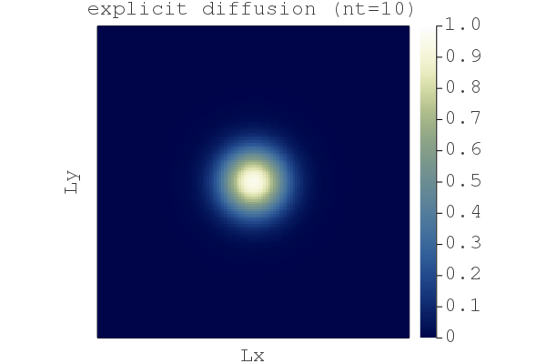
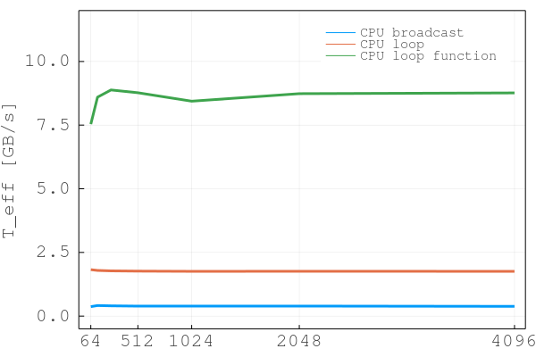
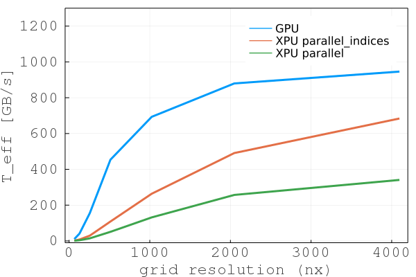
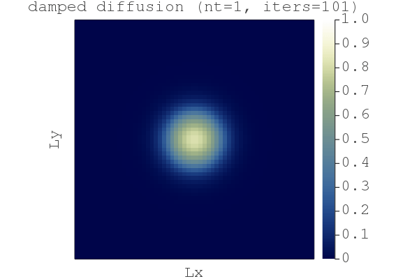

# Solving differential equations in parallel on GPUs

[](https://github.com/luraess/parallel-gpu-workshop-JuliaCon21/actions)

[**JuliaCon 2021 workshop | Fri, July 23, 10am-1pm ET (16:00-19:00 CEST)**](https://pretalx.com/juliacon2021/featured/)

<!-- [**LIVE STREAM JuliaCon 2021 workshop | Fri, July 23, 10am-1pm ET (16:00-19:00 CEST)**](https://www.youtube.com/watch?v=DvlM0w6lYEY) -->

👉 **Organisation notes:**
- 💡 The workshop material (available on this repository) **was just updated - fetch the latest versions!**
- 👉 **Make sure to go through [Getting started](#getting-started) before the start of the workshop.**
- ❓ Further interests in solving PDEs with Julia on GPUs
    - Check out this [online geo-HPC tutorial](https://github.com/luraess/geo-hpc-course)
    - Visit [EGU21's short course repo](https://github.com/luraess/julia-parallel-course-EGU21)

---

This workshop covers trendy areas in modern numerical computing with examples from geoscientific applications. The physical processes governing natural systems' evolution are often mathematically described as systems of differential equations or partial differential equations (PDE). Fast and accurate solutions require numerical implementations to leverage modern parallel hardware.


# Content
* [Objectives](#objectives)
* [About this repository](#about-this-repository)
* [Getting started](#getting-started) _(not discussed during the workshop)_
* 👉 [Workshop material](#workshop-material)
* [Extras](#extras) _(optional if time permits)_
* [Further reading](#further-reading)


# Objectives
The goal of this workshop is to offer an interactive hands-on to solve systems of differential equations in parallel on GPUs using the [ParallelStencil.jl] and [ImplicitGlobalGrid.jl] Julia packages. [ParallelStencil.jl] permits to write architecture-agnostic parallel high-performance GPU and CPU code and [ImplicitGlobalGrid.jl] renders stencil-based distributed parallelization almost trivial. The resulting codes are fast, short and readable \[[1][JuliaCon20a], [2][JuliaCon20b], [3][JuliaCon19]\].

We will use these two Julia packages to design and implement an iterative nonlinear diffusion solver. We will, in a second step, turn the serial CPU solver into a parallel application to run on multiple CPU threads and on GPUs. We will, in a third step, tackle distributed memory computing porting the nonlinear diffusion solver to execute on multiple CPUs and GPUs. The nonlinear diffusion solver we will work on can be applied to resolve the shallow ice approximation (SIA) equations with applications that predict ice flow dynamics over mountainous Greenland topography (Fig. below). 


👉 Visit [EGU21's short course repo](https://github.com/luraess/julia-parallel-course-EGU21) if interested.

**The workshop consists of 3 parts:**
1. [**Part 1**](#part-1---fast-iterative-solvers) - You will learn about accelerating iterative solvers.
2. [**Part 2**](#part-2---parallel-and-gpu-computing) - You will port the iterative solver to parallel CPU and GPU execution.
3. [**Part 3**](#part-3---distributed-computing-on-multiple-cpus-and-gpus) - You will learn how to implement multi-CPU and multi-GPU execution.

By the end of this workshop, you will:
- Have high-performance nonlinear PDE GPU solvers;
- Have a Julia code that achieves similar performance than legacy codes (C, CUDA, MPI);
- Be able to leverage the computing power of modern GPU accelerated servers and supercomputers.

⤴️ [_back to content_](#content)


# About this repository
The workshop repository lists following folders and items:
- the [docs](docs) folder contains documentation linked in the [README](README.md);
- the [scripts](scripts) folder contains the scripts this workshop is about 🎉
- the [extras](extras) folder contains supporting workshop material (not discussed live during the workshop);
- the [`Project.toml`](Project.toml) file is the Julia project file, tracking the used packages and enabling a reproducible environment.

> 👉 This repository is an interactive and dynamic source of information related to the workshop.
>- Check out the [**Discussion**](https://github.com/luraess/parallel-gpu-workshop-JuliaCon21/discussions) tab if you have general comments, ideas to share or for Q&A.
>- File an [**Issue**](https://github.com/luraess/parallel-gpu-workshop-JuliaCon21/issues) if you encounter any technical problems with the distributed codes.
>- Interact in a open-minded, respectful and inclusive manner.

⤴️ [_back to content_](#content)


# Getting started
> ⚠️ The workshop will not cover the Getting started steps. These are meant to provide directions to the participant willing to actively try out the examples during the workshop or for Julia newcomers. **It is warmly recommended to perform the Getting started steps before the beginning of the workshop.**

The detailed steps in the dropdown hereafter will get you started with:
1. Installing Julia v1.6
2. Running the scripts from the workshop repository.

<details>
<summary>CLICK HERE for the getting started steps 🚀</summary>
<br>

## Installing Julia v1.6 (or later)
Check you have an active internet connexion and [download Julia v1.6](https://julialang.org/downloads/) for your platform following the install directions provided under **\[help\]** if needed.

Alternatively, open a terminal and download the binaries (select the one for your platform):
```sh
wget https://julialang-s3.julialang.org/bin/winnt/x64/1.6/julia-1.6.1-win64.exe # Windows
wget https://julialang-s3.julialang.org/bin/mac/x64/1.6/julia-1.6.1-mac64.dmg # macOS
wget https://julialang-s3.julialang.org/bin/linux/x64/1.6/julia-1.6.1-linux-x86_64.tar.gz # Linux x86
```
Then add Julia to `PATH` (usually done in your `.bashrc`, `.profile`, or `config` file).

### Terminal + external editor
Ensure you have a text editor with syntax highlighting support for Julia. From within the terminal, type
```sh
julia
```
to make sure that the Julia REPL (aka terminal) starts.  Exit with `Ctrl-d`.

### VS Code
If you'd enjoy a more IDE type of environment, [check out VS Code](https://code.visualstudio.com). Follow the [installation directions](https://github.com/julia-vscode/julia-vscode#getting-started) for the [Julia VS Code extension](https://www.julia-vscode.org).

## Running the scripts
To get started with the workshop,
1. clone (or download the ZIP archive) the workshop repository ([help here](https://docs.github.com/en/github/creating-cloning-and-archiving-repositories/cloning-a-repository))
```sh
git clone https://github.com/luraess/parallel-gpu-workshop-JuliaCon21.git
```
2. Navigate to `parallel-gpu-workshop-JuliaCon21`
```sh
cd parallel-gpu-workshop-JuliaCon21
```
3. From the terminal, launch Julia with the `--project` flag to read-in project environment related informations such as used packages
```sh
julia --project
```
3. From VS Code, follow the [instructions from the documentation](https://www.julia-vscode.org/docs/stable/gettingstarted/) to get started.

### Packages installation
Now that you launched Julia, you should be in the [Julia REPL]. You need to ensure all the packages you need to be installed before using them. To do so, enter the [Pkg mode](https://docs.julialang.org/en/v1/stdlib/REPL/#Pkg-mode) by typing `]`. Then, `instantiate` the project which should trigger the download of the packages (`st` lists the package status). Exit the Pkg mode with `Ctrl-c`:
```julia-repl
julia> ]

(parallel-gpu-workshop-JuliaCon21) pkg> st
Status `~/parallel-gpu-workshop-JuliaCon21/Project.toml`
    # [...]

(parallel-gpu-workshop-JuliaCon21) pkg> instantiate
   Updating registry at `~/.julia/registries/General`
   Updating git-repo `https://github.com/JuliaRegistries/General.git`
   # [...]

julia>
```
To test your install, go to the [scripts](../scripts) folder and run the [`diffusion_2D_expl.jl`](/scripts/diffusion_2D_expl.jl) code. You can execute shell commands from within the [Julia REPL] first typing `;`:
```julia-repl
julia> ;

shell> cd scripts/

julia> include("diffusion_2D_expl.jl")
```
Running this the first time will (pre-)complie the various installed packages and will take some time. Subsequent runs, by executing `include("diffusion_2D_expl.jl")`, should take around 2s.

You should then see a figure displayed showing the nonlinear diffusion of a quantitiy `H` after `nt=666` steps:


## Multi-threading on CPUs
On the CPU, multi-threading is made accessible via [Base.Threads]. To make use of threads, Julia needs to be launched with
```sh
julia --project -t auto
```
which will launch Julia with as many threads are there are cores on your machine (including hyper-threaded cores).  Alternatively set
the environment variable [JULIA_NUM_THREADS], e.g. `export JULIA_NUM_THREADS=2` to enable 2 threads.

## Running on GPUs
The [CUDA.jl] module permits to launch compute kernels on Nvidia GPUs natively from within [Julia]. [JuliaGPU] provides further reading and [introductory material](https://juliagpu.gitlab.io/CUDA.jl/tutorials/introduction/) about GPU ecosystems within Julia. If you have an Nvidia CUDA capable GPU device, also export following environment vaiable prior to installing the [CUDA.jl] package:
```sh
export JULIA_CUDA_USE_BINARYBUILDER=false
```

## Julia MPI
The following steps permit you to install [MPI.jl] on your machine and test the it:
1. Julia MPI being a dependency of this Julia project [MPI.jl] should have been added upon executin `instantiate` command from within the package manager [see here](#packages-installation). 

2. Install `mpiexecjl`:
```julia-repl
julia> using MPI

julia> MPI.install_mpiexecjl()
[ Info: Installing `mpiexecjl` to `HOME/.julia/bin`...
[ Info: Done!
```
3. Then, one should add `HOME/.julia/bin` to PATH in order to launch the Julia MPI wrapper `mpiexecjl`.

4. Running a Julia MPI code `<my_script.jl>` on `np` processes:
```sh
$ HOME/.julia/bin/mpiexecjl -n np julia --project <my_script.jl>
```

5. To test the Julia MPI installation, launch the [hello_mpi.jl](extras/hello_mpi.jl) using the Julia MPI wrapper `mpiexecjl` (located in `~/.julia/bin`) on 4 processes:
```sh
$ mpiexecjl -n 4 julia --project extras/hello_mpi.jl
$ Hello world, I am 0 of 3
$ Hello world, I am 1 of 3
$ Hello world, I am 2 of 3
$ Hello world, I am 3 of 3
```
> 💡 Note: On MacOS, you may encounter this issue (https://github.com/JuliaParallel/MPI.jl/issues/407). To fix it, define following `ENV` variable:
```sh
$ export MPICH_INTERFACE_HOSTNAME=localhost
```
> and add `-host localhost` to the execution script:
```sh
$ HOME/.julia/bin/mpiexecjl -n 4 -host localhost julia --project extras/hello_mpi.jl
```

<br>
</details>

> 👉 **Note: This workshop was developed and tested on Julia v1.6. It should work with any Julia version ≥v1.6**. The install configuration were tested on a MacBook Pro running macOS 10.15.7, a Linux GPU server running Ubuntu 20.04 LTS and a Linux GPU server running CentOS 8.


# Workshop material
This section lists the material discussed within this 3h workshop:
* [Part 1 - GPU computing and iterative solvers](#part-1---fast-iterative-solvers)
    * [Diffusion equation](#diffusion-equation)
    * [Iterative solvers](#iterative-solvers)
    * [Performance considerations](#performance-considerations)
* [Part 2 - Parallel and GPU computing](#part-2---parallel-and-gpu-computing)
    * [Parallel CPU implementation](#parallel-cpu-implementation)
    * [GPU implementation](#gpu-implementation)
    * [XPU implementation](#xpu-implementation)
    * [Performance and scaling](#performance-and-scaling)
* [Part 3 - Distributed computing on multiple CPUs and GPUs](#part-3---distributed-computing-on-multiple-cpus-and-gpus)
    * [Distributed memory and fake parallelisation](#distributed-memory-and-fake-parallelisation)
    * [Distributed Julia computing using MPI](#distributed-julia-computing-using-mpi)
    * [Multi-XPU implementations in 2D](#multi-xpu-implementations-in-2d)

💡 In this workshop we will implement a 2D nonlinear diffusion equation on GPUs in Julia using the finite-difference method and an iterative solving approach.

⤴️ [_back to content_](#content)

## Part 1 - Fast iterative solvers
In this first part of the workshop we will implement an efficient implicit iterative and matrix-free solver to solve the time-dependent nonlinear diffusion equation in 2D.

### Diffusion equation
Let's start with a 2D nonlinear diffusion example to implement both an explicit and iterative implicit PDE solver:

  dH/dt = ∇.(H^3 ∇H)

The diffusion of a quantity `H` over time `t` can be described as (1a, 1b) a diffusive flux, (1c) a flux balance and (1d) an update rule:
```md
qHx   = -H^3*dH/dx         (1a)
qHy   = -H^3*dH/dy         (1b)
dHdt  = -dqHx/dx -dqHy/dy  (1c)
dH/dt = dHdt               (1d)
```
The [`diffusion_2D_expl.jl`](scripts/diffusion_2D_expl.jl) code implements an iterative and explicit solution of eq. (1) for an initial Gaussian profile:
```md
H0 = exp(-(x-lx/2.0)^2 -(y-ly/2.0)^2)
```



> 💡 The animation above was generated using the [`diffusion_2D_expl_gif.jl`](extras/diffusion_2D_expl_gif.jl) script located in [extras](extras).

A simple way to solve nonlinear diffusion, BUT:
- given the explicit nature of the scheme we have a restrictive limitation on the maximal allowed time step (subject to the CFL stability condition):
  ```md
  dt = minimum(min(dx, dy)^2 ./inn(H).^npow./4.1)
  ```
- there might be loss of accuracy since we use an explicit scheme for a nonlinear problem.

So now you may ask: can we use an implicit algorithm to ensure nonlinear accuracy, side-step the CFL-condition, control the (physically motivated) time steps `dt` _**and**_ keep it "matrix-free" ?

⤴️ [_back to workshop material_](#workshop-material)

### Iterative solvers
The [`diffusion_2D_impl.jl`](scripts/diffusion_2D_impl.jl) code implements an iterative, implicit solution of eq. (1). **How ?** We include the physical time derivative `dH/dt=(H-Hold)/dt` in the previous rate of change `dHdt` to define the residual `ResH`
```md
ResH = -(H-Hold)/dt -dqHx/dx -dqHy/dy
```
and iterate until the values of `ResH` (the residual of the eq. (1)) drop below a defined tolerance level `tol`.


It works, but the "naive" _Picard_ iteration count seems to be pretty high (`niter>800`). A efficient way to circumvent this is to add "damping" (`damp`) to the rate-of-change `dHdt`, analogous to add friction enabling faster convergence \[[4][Frankel50]\]
```md
dHdt = ResH + damp*dHdt
```
The [`diffusion_2D_damp.jl`](scripts/diffusion_2D_damp.jl) code implements a damped iterative implicit solution of eq. (1). The iteration count drops to `niter<200`. This second order pseudo-transient approach enables the iteration count to scales close to _O(N)_ and not _O(N^2)_; we will do a scaling test at the end of Part 2 in [Performance and scaling](#performance-and-scaling) section.


So far so good, we have a fast implicit iterative solver. But why to bother with implicit, wasn't explicit good enough ? Let's compare the difference between the explicit and the damped implicit results using the [`compare_expl_impl.jl`](scripts/compare_expl_impl.jl) script, chosing the "explicit" physical time step for both the explicit and implicit code:


We see that the explicit approach lead to a less sharp front by ~0.2% (when normalised by the implicit soution).

⤴️ [_back to workshop material_](#workshop-material)

### Performance considerations
Efficient algorithms should minimise the time to solution. For iterative algorithms this means:
1. Keep the iteration count as low as possible
2. Ensure fast iterations

We just achieved (1.) with the implicit damped approach. Let's fix (2.).

Many-core processors as GPUs are throughput-oriented systems that use their massive parallelism to hide latency. On the scientific application side, most algorithms require only a few operations or flops compared to the amount of numbers or bytes accessed from main memory, and thus are significantly memory bound; the Flop/s metric is no longer the most adequate for reporting performance. This status motivated the development of a memory throughput-based performance evaluation metric, `T_eff`, to evaluate the performance of iterative stencil-based solvers \[[1][JuliaCon20a]\].

The effective memory access, `A_eff` [GB], is the the sum of twice the memory footprint of the unknown fields, `D_u`, (fields that depend on their own history and that need to be updated every iteration) and the known fields, `D_k`, that do not change in time. The effective memory access divided by the execution time per iteration, `t_it` [sec], defines the effective memory throughput, `T_eff` [GB/s].

```md
A_eff = 2 D_u + D_k
T_eff = A_eff/t_it
```

The upper bound of `T_eff` is `T_peak`. Defining the `T_eff` metric, we assume that 1) we evaluate an iterative stencil-based solver, 2) the problem size is much larger than the cache sizes and 3) we do not rely on time blocking (reasonable assumption for real-world applications). An important concept is not to include fields within the effective memory access that do not depend on their own history (e.g. fluxes); such fields can be re-computed on the fly or stored on-chip.

Fore more details, check out the [performance related section](https://github.com/omlins/ParallelStencil.jl#performance-metric) from [ParallelStencil.jl].

For the 2D time-dependent diffusion equation, we thus have `D_u=2` and `D_k=1`:
```md
A_eff = (2 x 2 + 2 x 1) x 8 x nx x ny / 1e9 [GB]
```
Let's implement this measure in the following scripts.

⤴️ [_back to workshop material_](#workshop-material)

## Part 2 - Parallel and GPU computing
In this second part of the workshop, we will port the [`diffusion_2D_damp.jl`](scripts/diffusion_2D_damp.jl) script implemented using Julia CPU array broadcasting to parallel CPU and high-performance GPU implementations. 
```julia
# [...] skipped lines
qHx    .= -av_xi(H).^npow.*diff(H[:,2:end-1], dims=1)/dx  # flux
qHy    .= -av_yi(H).^npow.*diff(H[2:end-1,:], dims=2)/dy  # flux
ResH   .= -(inn(H) - inn(Hold))/dt + 
           (-diff(qHx, dims=1)/dx -diff(qHy, dims=2)/dy)  # residual of the PDE
dHdtau .= ResH + damp*dHdtau                              # damped rate of change
dtau   .= (1.0./(min(dx, dy)^2 ./inn(H).^npow./4.1) .+ 1.0/dt).^-1  # time step (obeys ~CFL condition)
H[2:end-1,2:end-1] .= inn(H) .+ dtau.*dHdtau              # update rule, sets the BC as H[1]=H[end]=0
# [...] skipped lines
```
The first step is to modify this script in order to make it more suited for performance testing. In the resulting [`diffusion_2D_damp_perf.jl`](scripts/diffusion_2D_damp_perf.jl) we:
- replace the non-necessary array allocation by macros
- introduce `H2` array to avoid race conditions
- use non-allocating `diff` operators: `LazyArrays: Diff`
- add accurate timing of the main loop and `T_eff` reporting
resulting in the following code:
```julia
using LazyArrays
using LazyArrays: Diff
# [...] skipped lines
macro qHx()  esc(:( -av_xi(H).^npow.*Diff(H[:,2:end-1], dims=1)/dx )) end
macro qHy()  esc(:( -av_yi(H).^npow.*Diff(H[2:end-1,:], dims=2)/dy )) end
macro dtau() esc(:( (1.0./(min(dx, dy)^2 ./inn(H).^npow./4.1) .+ 1.0/dt).^-1  )) end
# [...] skipped lines
if (it==1 && iter==0) t_tic = Base.time(); niter = 0 end
dHdtau .= -(inn(H) - inn(Hold))/dt + 
           (-Diff(@qHx(), dims=1)/dx -Diff(@qHy(), dims=2)/dy) +
           damp*dHdtau                              # damped rate of change
H2[2:end-1,2:end-1] .= inn(H) .+ @dtau().*dHdtau    # update rule, sets the BC as H[1]=H[end]=0
H, H2 = H2, H                                       # pointer swap
# [...] skipped lines
t_toc = Base.time() - t_tic
A_eff = (2*2+1)/1e9*nx*ny*sizeof(Float64)  # Effective main memory access per iteration [GB]
t_it  = t_toc/niter                        # Execution time per iteration [s]
T_eff = A_eff/t_it                         # Effective memory throughput [GB/s]
# [...] skipped lines
```
Running [`diffusion_2D_damp_perf.jl`](scripts/diffusion_2D_damp_perf.jl) with `nx = ny = 512`, starting Julia with `-O3 --check-bounds=no` produces following output on an Intel Quad-Core i5-4460  CPU @3.20GHz processor (`T_peak = 17 GB/s` measured with [`memcopy3D.jl`](extras/memcopy3D.jl)):
```julia-repl
Time = 21.523 sec, T_eff = 0.39 GB/s (niter = 804)
```

⤴️ [_back to workshop material_](#workshop-material)

### Parallel CPU implementation
The next step step is to modify the diffusion code [`diffusion_2D_damp_perf.jl`](scripts/diffusion_2D_damp_perf.jl) by transforming the isolated physics calculations (see end of previous section) into spatial loops over `ix` and `iy`, resulting in the [`diffusion_2D_damp_perf_loop.jl`](scripts/diffusion_2D_damp_perf_loop.jl) code:
```julia
# [...] skipped lines
macro qHx(ix,iy)  esc(:( -(0.5*(H[$ix,$iy+1]+H[$ix+1,$iy+1]))^npow * (H[$ix+1,$iy+1]-H[$ix,$iy+1])/dx )) end
macro qHy(ix,iy)  esc(:( -(0.5*(H[$ix+1,$iy]+H[$ix+1,$iy+1]))^npow * (H[$ix+1,$iy+1]-H[$ix+1,$iy])/dy )) end
macro dtau(ix,iy) esc(:(  (1.0/(min(dx,dy)^2 / H[$ix+1,$iy+1]^npow/4.1) + 1.0/dt)^-1  )) end
# [...] skipped lines
for iy=1:size(dHdtau,2)
    for ix=1:size(dHdtau,1)
        dHdtau[ix,iy] = -(H[ix+1, iy+1] - Hold[ix+1, iy+1])/dt + 
                         (-(@qHx(ix+1,iy)-@qHx(ix,iy))/dx -(@qHy(ix,iy+1)-@qHy(ix,iy))/dy) +
                         damp*dHdtau[ix,iy]                        # damped rate of change
    end
end
for iy=1:size(dHdtau,2)
    for ix=1:size(dHdtau,1)
        H2[ix+1,iy+1] = H[ix+1,iy+1] + @dtau(ix,iy)*dHdtau[ix,iy]  # update rule, sets the BC as H[1]=H[end]=0
    end
end
H, H2 = H2, H  # pointer swap
# [...] skipped lines
```
> 💡 Note that macros can now take `ix` and `iy` as arguments.

Running [`diffusion_2D_damp_perf_loop.jl`](scripts/diffusion_2D_damp_perf_loop.jl) with `nx = ny = 512` produces following output:
```julia-repl
Time = 4.774 sec, T_eff = 1.80 GB/s (niter = 804)
```

The next step is to wrap these physics calculations into functions (later called kernels on the GPU) and define them before the main function of the script, resulting in the [`diffusion_2D_damp_perf_loop_fun.jl`](scripts/diffusion_2D_damp_perf_loop_fun.jl) code. Note the loop fusion in the `function compute_update!()`:
```julia
# [...] skipped lines
macro qHx(ix,iy)  esc(:( -(0.5*(H[$ix,$iy+1]+H[$ix+1,$iy+1]))*(0.5*(H[$ix,$iy+1]+H[$ix+1,$iy+1]))*(0.5*(H[$ix,$iy+1]+H[$ix+1,$iy+1])) * (H[$ix+1,$iy+1]-H[$ix,$iy+1])*_dx )) end
macro qHy(ix,iy)  esc(:( -(0.5*(H[$ix+1,$iy]+H[$ix+1,$iy+1]))*(0.5*(H[$ix+1,$iy]+H[$ix+1,$iy+1]))*(0.5*(H[$ix+1,$iy]+H[$ix+1,$iy+1])) * (H[$ix+1,$iy+1]-H[$ix+1,$iy])*_dy )) end
macro dtau(ix,iy) esc(:(  (1.0/(min_dxy2 / (H[$ix+1,$iy+1]*H[$ix+1,$iy+1]*H[$ix+1,$iy+1]) / 4.1) + _dt)^-1  )) end

function compute_update!(H2, dHdtau, H, Hold, _dt, damp, min_dxy2, _dx, _dy)
    Threads.@threads for iy=1:size(dHdtau,2)
    # for iy=1:size(dHdtau,2)
        for ix=1:size(dHdtau,1)
            dHdtau[ix,iy] = -(H[ix+1, iy+1] - Hold[ix+1, iy+1])*_dt + 
                             (-(@qHx(ix+1,iy)-@qHx(ix,iy))*_dx -(@qHy(ix,iy+1)-@qHy(ix,iy))*_dy) +
                             damp*dHdtau[ix,iy]                        # damped rate of change
            H2[ix+1,iy+1] = H[ix+1,iy+1] + @dtau(ix,iy)*dHdtau[ix,iy]  # update rule, sets the BC as H[1]=H[end]=0
        end
    end
    return
end
# [...] skipped lines
_dx, _dy, _dt = 1.0/dx, 1.0/dy, 1.0/dt
min_dxy2 = min(dx,dy)^2
compute_update!(H2, dHdtau, H, Hold, _dt, damp, min_dxy2, _dx, _dy)
# [...] skipped lines
```
> 💡 Note that the outer loop (over `iy`) can be vectorized using multi-threading capabilities of the CPU accessible via `Threads.@threads` (see [Getting started](#getting-started) for more infos).

Running [`diffusion_2D_damp_perf_loop_fun.jl`](scripts/diffusion_2D_damp_perf_loop_fun.jl) with `nx = ny = 512` on 4 cores produces following output:
```julia-repl
Time = 0.961 sec, T_eff = 8.80 GB/s (niter = 804)
```
Since the performance increases and gets closer to hardware limit (memory copy values), some details start to become perfromance limiters, namely:
- divisions instead of multiplications
- arithmetic operation such as power `H^npow`

These details will become even more important on the GPU.

We are now ready to move to the GPU !

⤴️ [_back to workshop material_](#workshop-material)

### GPU implementation
So we now have a cool iterative and implicit nonlinear diffusion solver in less than 100 lines of code 🎉. Good enough for mid-resolution calculations. What if we need higher resolution and faster time to solution ? GPU computing makes it possible to go beyond 16 GB/s. Let's slightly modify the [`diffusion_2D_damp_perf_loop_fun.jl`](scripts/diffusion_2D_damp_perf_loop_fun.jl) code to enable GPU execution.

The main idea of GPU parallelisation is to calculate each grid point concurrently by a different GPU thread (instead of the more serial CPU execution) as depicted hereafter:


The main change is to replace the (multi-threaded) loops by a vectorised GPU index
```julia
ix = (blockIdx().x-1) * blockDim().x + threadIdx().x
iy = (blockIdx().y-1) * blockDim().y + threadIdx().y
```
specific to GPU execution. Each `ix` and `iy` are then executed concurrently by a different GPU thread. Also, whether a grid point has to participate in the calculation or not can no longer be defined by the loop range, but needs to be handled locally to each thread by e.g. an `if`condition, resulting in the following [`diffusion_2D_damp_perf_gpu.jl`](scripts/diffusion_2D_damp_perf_gpu.jl) GPU code:
```julia
using CUDA
# [...] skipped lines
function compute_update!(H2, dHdtau, H, Hold, _dt, damp, min_dxy2, _dx, _dy)
    ix = (blockIdx().x-1) * blockDim().x + threadIdx().x
    iy = (blockIdx().y-1) * blockDim().y + threadIdx().y
    if  (ix<=size(dHdtau,1) && iy<=size(dHdtau,2)) dHdtau[ix,iy] = -(H[ix+1, iy+1] - Hold[ix+1, iy+1])*_dt + 
                                                                    (-(@qHx(ix+1,iy)-@qHx(ix,iy))*_dx -(@qHy(ix,iy+1)-@qHy(ix,iy))*_dy) +
                                                                    damp*dHdtau[ix,iy] end                       # damped rate of change
    if  (ix<=size(dHdtau,1) && iy<=size(dHdtau,2)) H2[ix+1,iy+1] = H[ix+1,iy+1] + @dtau(ix,iy)*dHdtau[ix,iy] end # update rule, sets the BC as H[1]=H[end]=0
    return
end
# [...] skipped lines
BLOCKX = 32
BLOCKY = 8
GRIDX  = 16*16
GRIDY  = 32*32
nx, ny = BLOCKX*GRIDX, BLOCKY*GRIDY # numerical grid resolution
# [...] skipped lines
ResH   = CUDA.zeros(Float64, nx-2, ny-2) # normal grid, without boundary points
dHdtau = CUDA.zeros(Float64, nx-2, ny-2) # normal grid, without boundary points
# [...] skipped lines
H      = CuArray(exp.(.-(xc.-lx/2).^2 .-(yc.-ly/2)'.^2))
# [...] skipped lines
cuthreads = (BLOCKX, BLOCKY, 1)
cublocks  = (GRIDX,  GRIDY,  1)
# [...] skipped lines
@cuda blocks=cublocks threads=cuthreads compute_update!(H2, dHdtau, H, Hold, _dt, damp, min_dxy2, _dx, _dy)
synchronize()
# [...] skipped lines
```
> 💡 We use `@cuda blocks=cublocks threads=cuthreads` to launch the GPU function on the appropriate number of threads, i.e. "parallel workers". The numerical grid resolution `nx` and `ny` must now be chosen accordingly to the number of parallel workers. Also, note that we need to run a higher resolution in order to saturate the GPU memory bandwidth and get relevant performance measure.

> ⚠ Default precision in `CUDA.jl` is `Float32`, so we have to enforce `Float64` here.

Running [`diffusion_2D_damp_perf_gpu.jl`](scripts/diffusion_2D_damp_perf_gpu.jl) with `nx = ny = 8192` produces following output on an Nvidia Tesla V100 PCIe (16GB) GPU (`T_peak = 840 GB/s` measured with [`memcopy3D.jl`](extras/memcopy3D.jl)):
```julia-repl
Time = 10.084 sec, T_eff = 770.00 GB/s (niter = 2904)
```
So - that rocks 🚀

⤴️ [_back to workshop material_](#workshop-material)

### XPU implementation
Let's do a rapid recap; So far we have two performant codes, one CPU-based, the other GPU-based, to solve the nonlinear and implicit diffusion equation in 2D. Wouldn't it be great to have single code that enables both ? The answer is [ParallelStencil.jl] which enables a backend independent syntax implementing parallel stencil kernels to execute on XPUs. The [`diffusion_2D_damp_perf_xpu.jl`](scripts/diffusion_2D_damp_perf_xpu.jl) code uses [ParallelStencil.jl] to combine [`diffusion_2D_damp_perf_gpu.jl`](scripts/diffusion_2D_damp_perf_gpu.jl) and [`diffusion_2D_damp_perf_loop_fun.jl`](scripts/diffusion_2D_damp_perf_loop_fun.jl) into a single code. Backend can be chosen by the `USE_GPU` flag. Using the `parallel_indices` permits to avoid explicit flux calculations:
```julia
const USE_GPU = true
using ParallelStencil
using ParallelStencil.FiniteDifferences2D
@static if USE_GPU
    @init_parallel_stencil(CUDA, Float64, 2)
else
    @init_parallel_stencil(Threads, Float64, 2)
end
# [...] skipped lines
@parallel_indices (ix,iy) function compute_update!(H2, dHdtau, H, Hold, _dt, damp, min_dxy2, _dx, _dy)
    if (ix<=size(dHdtau,1) && iy<=size(dHdtau,2)) dHdtau[ix,iy] = -(H[ix+1, iy+1] - Hold[ix+1, iy+1])*_dt + 
                                                                   (-(@qHx(ix+1,iy)-@qHx(ix,iy))*_dx -(@qHy(ix,iy+1)-@qHy(ix,iy))*_dy) +
                                                                   damp*dHdtau[ix,iy] end                       # damped rate of change
    if (ix<=size(dHdtau,1) && iy<=size(dHdtau,2)) H2[ix+1,iy+1] = H[ix+1,iy+1] + @dtau(ix,iy)*dHdtau[ix,iy] end # update rule, sets the BC as H[1]=H[end]=0
    return
end
# [...] skipped lines
@parallel compute_update!(H2, dHdtau, H, Hold, _dt, damp, min_dxy2, _dx, _dy)
# [...] skipped lines
```
> 💡 Note that CPU backend of [ParallelStencil.jl] currently supports `Threads.@threads`.

Running [`diffusion_2D_damp_perf_xpu.jl`](scripts/diffusion_2D_damp_perf_xpu.jl) with `nx = ny = 8192` on an Nvidia Tesla V100 PCIe (16GB) GPU produces following output:
```julia-repl
Time = 10.323 sec, T_eff = 760.00 GB/s (niter = 2904)
```

The alternative and "default" implementation using [ParallelStencil.jl] would allow for using macros exposed by the `FiniteDifferences2D` module for a math-close notation in the kernels:
```julia
# [...] skipped lines
@parallel function compute_flux!(qHx, qHy, H, _dx, _dy)
    @all(qHx) = -@av_xi(H)*@av_xi(H)*@av_xi(H)*@d_xi(H)*_dx
    @all(qHy) = -@av_yi(H)*@av_yi(H)*@av_yi(H)*@d_yi(H)*_dy
    return
end

macro dtau() esc(:( (1.0/(min_dxy2 / (@inn(H)*@inn(H)*@inn(H)) / 4.1) + _dt)^-1 )) end
@parallel function compute_update!(dHdtau, H, Hold, qHx, qHy, _dt, damp, min_dxy2, _dx, _dy)
    @all(dHdtau) = -(@inn(H) - @inn(Hold))*_dt - @d_xa(qHx)*_dx - @d_ya(qHy)*_dy + damp*@all(dHdtau)
    @inn(H)      =   @inn(H) + @dtau()*@all(dHdtau)
    return
end
```
Running [`diffusion_2D_damp_xpu.jl`](scripts/diffusion_2D_damp_xpu.jl) with `nx = ny = 8192` on an Nvidia Tesla V100 PCIe (16GB) GPU produces following output:
```julia-repl
Time = 21.420 sec, T_eff = 360.00 GB/s (niter = 2904)
```

⤴️ [_back to workshop material_](#workshop-material)

### Performance and scaling
We have developed 6 scripts, 3 CPU-based and 3 GPU-based, we can now use to realise a scaling test and report `T_eff` as function of numerical grid resolution `nx = [64 128, 256, 512, 1024, 2048, 4096]` and including `[..., 8192, 16384]` values on the GPU:





Note that `T_peak` of the Nvidia Tesla V100 GPU is 840 GB/s. Our GPU code thus achieves 92% of hardware peak performance. The codes used for performance tests and testing routine can be found in [extras/diffusion_2D_perf_tests](extras/diffusion_2D_perf_tests).

⤴️ [_back to workshop material_](#workshop-material)

## Part 3 - Distributed computing on multiple CPUs and GPUs
In this last part of the workshop, we will explore multi-XPU capabilities. This will enable our codes to run on multiple CPUs and GPUs in order to scale on modern multi-GPU nodes, clusters and supercomputers. Also, we will experiment with basic concepts of distributed memory computing approach using Julia's MPI wrapper [MPI.jl]. In the proposed approach, each MPI process handles one CPU thread. In the MPI GPU case (multi-GPUs), each MPI process handles one GPU. The [Getting started](#getting-started) section contains useful information in the **Julia MPI** section to get you set up.

### Distributed memory and fake parallelisation
As a first step, we will look at the [`diffusion_1D_2procs.jl`](scripts/diffusion_1D_2procs.jl) code that solves the linear diffusion equations using a "fake-parallelisation" approach. We split the calculation on two distinct left and right domains, wich requires left and right `H` arrays, `HL` and `HR`, respectively:
```julia
# Compute physics locally
HL[2:end-1] .= HL[2:end-1] + dt*λ*diff(diff(HL)/dx)/dx
HR[2:end-1] .= HR[2:end-1] + dt*λ*diff(diff(HR)/dx)/dx
# Update boundaries (later MPI)
HL[end] = HR[2]
HR[1]   = HL[end-1]
# Global picture
H .= [HL[1:end-1]; HR[2:end]]
```
We see that a correct boundary update is the critical part for a successful implementation. In our apporach, we need an overlap of 2 cells in order to avoid any artifacts at the transition between the left and right domains.

The next step would be to generalise the "2 processes" concept to "n-processes", keeping the "fake-parallelisation" approach. The [`diffusion_1D_nprocs.jl`](scripts/diffusion_1D_nprocs.jl) code contains this modification:
```julia
for ip = 1:np # compute physics locally
    H[2:end-1,ip] .= H[2:end-1,ip] + dt*λ*diff(diff(H[:,ip])/dxg)/dxg
end
for ip = 1:np-1 # update boundaries
    H[end,ip  ] = H[    2,ip+1]
    H[  1,ip+1] = H[end-1,ip  ]
end
for ip = 1:np # global picture
    i1 = 1 + (ip-1)*(nx-2)
    Hg[i1:i1+nx-2] .= H[1:end-1,ip]
end
```
The number of fake processes are stored in the second dimension of the array `H`. The `# update boundaries` steps are adpted accordingly. All the physica calculations happen on the local chunks of the arrays. We only need "global" knowledge in the definition of the initial condition, in order to e.g. initialise the Gaussian distribution using global and not local coordinates.

So far, so good, we are now ready to write a script that would truly distribute calculations on different processors using [MPI.jl].

⤴️ [_back to workshop material_](#workshop-material)

### Distributed Julia computing using MPI
As next step, let's see what are the minimal steps that would allow us to write an MPI-parallel code in Julia. We will solve the following linear diffusion physics:
```julia
for it = 1:nt
    qHx        .= -λ*diff(H)/dx
    H[2:end-1] .= H[2:end-1] - dt*diff(qHx)/dx
end
```
on multiple processors. The [`diffusion_1D_mpi.jl`](scripts/diffusion_1D_mpi.jl) code implements the following steps:
1. Initialise MPI and set-up a Cartesian world
2. Implement a boundary exchange routine
3. Finalise MPI
4. Create a "global" intial condition

To (1.) initialise MPI and prepare the Cartesian world, we define:
```julia
MPI.Init()
dims        = [0]
comm        = MPI.COMM_WORLD
nprocs      = MPI.Comm_size(comm)
MPI.Dims_create!(nprocs, dims)
comm_cart   = MPI.Cart_create(comm, dims, [0], 1)
me          = MPI.Comm_rank(comm_cart)
coords      = MPI.Cart_coords(comm_cart)
neighbors_x = MPI.Cart_shift(comm_cart, 0, 1)
```
where `me` represents the process ID unique to each MPI process.

Then, we need to (2.) implement a boundary exchange routine. For conciseness, we will here use blocking messages:
```julia
@views function update_halo(A, neighbors_x, comm)
    if neighbors_x[1] >= 0 # MPI_PROC_NULL?
        sendbuf = A[2]
        recvbuf = zeros(1)
        MPI.Send(sendbuf,  neighbors_x[1], 0, comm)
        MPI.Recv!(recvbuf, neighbors_x[1], 1, comm)
        A[1] = recvbuf[1]
    end
    if neighbors_x[2] >= 0 # MPI_PROC_NULL?
        sendbuf = A[end-1]
        recvbuf = zeros(1)
        MPI.Send(sendbuf,  neighbors_x[2], 1, comm)
        MPI.Recv!(recvbuf, neighbors_x[2], 0, comm)
        A[end] = recvbuf[1]
    end
    return
end
```
In a nutshell, we store the boundary values we want to exchange in a send buffer `sednbuf` and initialise a receive buffer `recvbuf`. MPI then swaps the buffers (sending messages `MPI.Send(), MPI.Recv!()`) and we have to assign to the boundary the values from the receeive buffer.

Last, we need to (3.) finalise MPI prior to returning from the main
```julia
MPI.Finalize()
```
The remaining step is to (4.) create an initial Gaussian distribution of `H` that spans correctly over all local domains. This can be achieved as following:
```julia
x0    = coords[1]*(nx-2)*dx
xc    = [x0 + ix*dx - dx/2 - 0.5*lx  for ix=1:nx]
H     = exp.(.-xc.^2)
```
where `x0` represents the first global x-coordinate on every process and `xc` represents the local chunk of the global coordinates on each local process.

Running the [`diffusion_1D_mpi.jl`](scripts/diffusion_1D_mpi.jl) code
```sh
HOME/.julia/bin/mpiexecjl -n 4 julia --project diffusion_1D_mpi.jl
```
will generate one output file for each MPI process. Use the [scripts/vizme1D_mpi.jl](scripts/vizme1D_mpi.jl) script to reconstruct the global `H` array from the local results and visualise it.

Yay 🎉 - we just made a Julia parallel MPI diffusion solver in _only_ 70 lines of code.

Hold-on, the [`diffusion_2D_mpi.jl`](scripts/diffusion_2D_mpi.jl) code implements a 2D version of the [`diffusion_1D_mpi.jl`](scripts/diffusion_1D_mpi.jl) code. Nothing is really new in there, but it may be interesting to see how boundary update routines are defined in 2D as one now needs to exchange vectors instead of single values. Running the [`diffusion_2D_mpi.jl`](scripts/diffusion_2D_mpi.jl) will generate one output file per MPI process and the [`vizme2D_mpi.jl`](scripts/vizme2D_mpi.jl) script can then be used for visualisation purpose.

⤴️ [_back to workshop material_](#workshop-material)

### Multi-XPU implementations in 2D
Let's do a quick recap: so far, we explored the concept of distributed memory parallelisation with simple "fake-parallel" codes. We then demystified the usage of MPI in Julia within a 1D and 2D diffusion solver using [MPI.jl], a Cartesian topology and blocking message. This code would already execute on many processors and could be launched on a cluster. 

The remaining steps are to:
- use non-blocking communication
- use multiple GPUs
- prevent MPI communication to become the performance killer

We address these steps using [ImplicitGlobalGrid.jl] along with [ParallelStencil.jl]. As final act of this workshop we will take the high-performance XPU [`diffusion_2D_damp_perf_xpu.jl`](scripts/diffusion_2D_damp_perf_xpu.jl) code from [Part 2](#xpu-implementation) and add the few [ImplicitGlobalGrid.jl] features in order to have a multi-XPU code ready to scale on GPU supercomputers.

Appreciate the few minor changes (not including those for visualisation - **10 new lines only**) required to get the multi-XPU code [`diffusion_2D_damp_perf_multixpu.jl`](scripts/diffusion_2D_damp_perf_multixpu.jl):
```julia
# [...] skipped lines
using ImplicitGlobalGrid, Plots, Printf, LinearAlgebra
import MPI
# [...] skipped lines
norm_g(A) = (sum2_l = sum(A.^2); sqrt(MPI.Allreduce(sum2_l, MPI.SUM, MPI.COMM_WORLD)))
# [...] skipped lines
me, dims = init_global_grid(nx, ny, 1)  # MPI initialisation
@static if USE_GPU select_device() end  # select one GPU per MPI local rank (if >1 GPU per node)
dx, dy = lx/nx_g(), ly/ny_g()           # grid size
damp   = 1-35/nx_g()                    # damping (this is a tuning parameter, dependent on e.g. grid resolution)
# [...] skipped lines
H     .= Data.Array([exp(-(x_g(ix,dx,H)+dx/2 -lx/2)^2 -(y_g(iy,dy,H)+dy/2 -ly/2)^2) for ix=1:size(H,1), iy=1:size(H,2)])
# [...] skipped lines
len_ResH_g = ((nx-2-2)*dims[1]+2)*((ny-2-2)*dims[2]+2)
# [...] skipped lines
@hide_communication (8, 4) begin # communication/computation overlap
    @parallel compute_update!(H2, dHdtau, H, Hold, _dt, damp, min_dxy2, _dx, _dy)
    H, H2 = H2, H
    update_halo!(H)
end
# [...] skipped lines
err = norm_g(ResH)/len_ResH_g
# [...] skipped lines
finalize_global_grid()
# [...] skipped lines
```
Running this code with `do_visu = true` will generate the following gif



⤴️ [_back to workshop material_](#workshop-material)

# Further reading
\[1\] [Omlin, S., Räss, L., Kwasniewski, G., Malvoisin, B., & Podladchikov, Y. Y. (2020). Solving Nonlinear Multi-Physics on GPU Supercomputers with Julia. JuliaCon Conference, virtual.][JuliaCon20a]

\[2\] [Räss, L., Reuber, G., & Omlin, S. (2020). Multi-Physics 3-D Inversion on GPU Supercomputers with Julia. JuliaCon Conference, virtual.][JuliaCon20b]

\[3\] [Räss, L., Omlin, S., & Podladchikov, Y. Y. (2019). Porting a Massively Parallel Multi-GPU Application to Julia: a 3-D Nonlinear Multi-Physics Flow Solver. JuliaCon Conference, Baltimore, USA.][JuliaCon19]

\[4\] [Frankel, S. P. (1950). Convergence rates of iterative treatments of partial differential equations, Mathe. Tables Other Aids Comput., 4, 65–75.][Frankel50]

⤴️ [_back to content_](#content)


[Julia]: https://julialang.org
[Julia language]: https://docs.julialang.org/en/v1/
[Julia REPL]: https://docs.julialang.org/en/v1/stdlib/REPL/
[Base.Threads]: https://docs.julialang.org/en/v1/base/multi-threading/
[JULIA_NUM_THREADS]:https://docs.julialang.org/en/v1.0.0/manual/environment-variables/#JULIA_NUM_THREADS-1
[CUDA.jl]: https://github.com/JuliaGPU/CUDA.jl
[JuliaGPU]: https://juliagpu.org
[ParallelStencil.jl]: https://github.com/omlins/ParallelStencil.jl
[ImplicitGlobalGrid.jl]: https://github.com/eth-cscs/ImplicitGlobalGrid.jl
[MPI.jl]: https://juliaparallel.github.io/MPI.jl/stable/examples/01-hello/

[JuliaCon20a]: https://www.youtube.com/watch?v=vPsfZUqI4_0
[JuliaCon20b]: https://www.youtube.com/watch?v=1t1AKnnGRqA
[JuliaCon19]: https://www.youtube.com/watch?v=b90qqbYJ58Q
[Frankel50]: https://doi.org/10.2307/2002770
