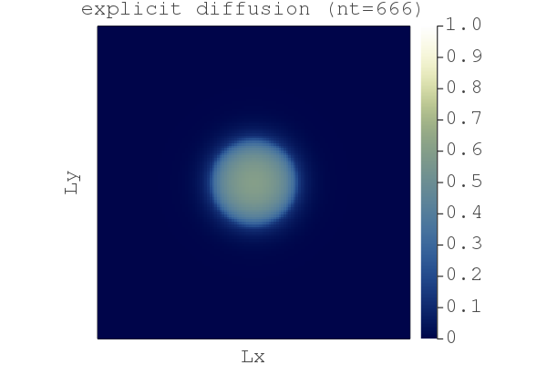
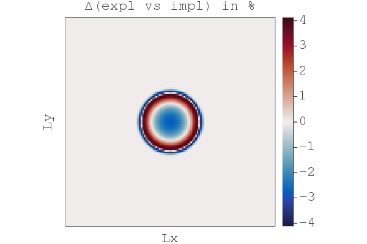

# Solving differential equations in parallel on GPUs

[](https://github.com/luraess/parallel-gpu-workshop-JuliaCon21/actions)

**[JuliaCon 2021 workshop | Fri, July 23, 10am-1pm ET (16:00-19:00 CEST)](https://pretalx.com/juliacon2021/featured/)**

👉 **Organisation notes:**
- 💡 The workshop material (available on this repository) **was just updated - fetch the latest versions!**
- 👉 **Make sure to go through [Getting started](#getting-started) before the start of the workshop.**
- Further interests in solving PDEs with Julia on GPUs❓
    - Check out this [online geo-HPC tutorial](https://github.com/luraess/geo-hpc-course)
    - Visit [EGU21's short course repo](https://github.com/luraess/julia-parallel-course-EGU21)

---

This workshop covers trendy areas in modern numerical computing with examples from geoscientific applications. The physical processes governing natural systems' evolution are often mathematically described as systems of differential equations or partial differential equations (PDE). Fast and accurate solutions require numerical implementations to leverage modern parallel hardware.

# Content
* [Objectives](#objectives)
* [About this repository](#about-this-repository)
* [Getting started](#getting-started) _(not discussed during the workshop)_
* 👉 [Workshop material](#workshop-material)
* [Extras](#extras) _(optional if time permits)_
* [Further reading](#further-reading)


# Objectives
The goal of this workshop is to offer an interactive hands-on to solve systems of differential equations in parallel on GPUs using the [ParallelStencil.jl] and [ImplicitGlobalGrid.jl] Julia packages. [ParallelStencil.jl] permits to write architecture-agnostic parallel high-performance GPU and CPU code and [ImplicitGlobalGrid.jl] renders stencil-based distributed parallelization almost trivial. The resulting codes are fast, short and readable \[[1][JuliaCon20a], [2][JuliaCon20b], [3][JuliaCon19]\].

We will use these two Julia packages to design and implement a nonlinear diffusion GPU solver. We will, in a second step, turn the GPU solver into an application that predicts ice flow dynamics over mountainous Greenland topography (Fig. below). We will discretise the shallow ice approximation (SIA) equations in our ice flow solver to assess Greenland's ice cap evolution as function of a climate scenario.


**The workshop consists of 3 parts:**
1. [**Part 1**](#part-1---fast-iterative-solvers) - You will learn about accelerating iterative solvers.
2. [**Part 2**](#part-2---parallel-and-gpu-computing) - You will port the iterative solver from to parallel CPU and GPUs.
3. [**Part 3**](#part-3---solving-ice-flow-pdes-on-gpus) - You will implement a GPU parallel PDE solver to predict ice flow dynamics on real topography.

By the end of this workshop, you will:
- Have a GPU PDE solver that predicts ice-flow;
- Have a Julia code that achieves similar performance than legacy codes (C, CUDA, MPI);
- Be able to leverage the computing power of modern GPU accelerated servers and supercomputers.

<!-- > 💡 **Disclaimer**
>- The solvers presented in this workshop, based on the **pseudo-transient method**, enable to solve PDEs iteratively and are well-suited for parallel execution (on GPUs). It is **not** the purpose of this workshop to provide an extensive overview of various solution techniques.
>- The performance assessment is done using the time / iteration metric which reflects the ability of the algorithm to efficiently exploit the memory bandwidth of the (parallel) hardware. Further performance considerations regarding the metric can be found [here](https://github.com/omlins/ParallelStencil.jl). -->

⤴️ [_back to content_](#content)


# About this repository
The workshop repository lists following folders and items:
- the [data](data) folder contains various low resolution Greenland input data (bedrock topography, surface elevation, ice thickness, masks, ...) downscaled from [BedMachine Greenland v3] - note the filenames include grid resolution information `(nx, ny)`;
- the [docs](docs) folder contains documentation linked in the [README](README.md);
- the various _output_ folder will contain the codes output, mainly figures in `png` format;
- the [scripts](scripts) folder contains the scripts this workshop is about 🎉
- the [extras](extras) folder contains supporting workshop material (not discussed live during the workshop);
- the [`Project.toml`](Project.toml) file is the Julia project file, tracking the used packages and enabling a reproducible environment.

> 👉 This repository is an interactive and dynamic source of information related to the workshop.
>- Check out the [**Discussion**](https://github.com/luraess/parallel-gpu-workshop-JuliaCon21/discussions) tab if you have general comments, ideas to share or for Q&A.
>- File an [**Issue**](https://github.com/luraess/parallel-gpu-workshop-JuliaCon21/issues) if you encounter any technical problems with the distributed codes.
>- Interact in a open-minded, respectful and inclusive manner.

⤴️ [_back to content_](#content)

# Getting started
> ⚠️ The workshop will not cover the Getting started steps. These are meant to provide directions to the participant willing to actively try out the examples during the workshop or for Julia newcomers. **It is warmly recommended to perform the Getting started steps before the beginning of the workshop.**

The detailed steps in the dropdown hereafter will get you started with:
1. Installing Julia v1.6
2. Running the scripts from the workshop repository.

<details>
<summary>CLICK HERE for the getting started steps 🚀</summary>
<br>

## Installing Julia v1.6 (or later)
Check you have an active internet connexion and [download Julia v1.6](https://julialang.org/downloads/) for your platform following the install directions provided under **\[help\]** if needed.

Alternatively, open a terminal and download the binaries (select the one for your platform):
```sh
wget https://julialang-s3.julialang.org/bin/winnt/x64/1.6/julia-1.6.1-win64.exe # Windows
wget https://julialang-s3.julialang.org/bin/mac/x64/1.6/julia-1.6.1-mac64.dmg # macOS
wget https://julialang-s3.julialang.org/bin/linux/x64/1.6/julia-1.6.1-linux-x86_64.tar.gz # Linux x86
```
Then add Julia to `PATH` (usually done in your `.bashrc`, `.profile`, or `config` file).

### Terminal + external editor
Ensure you have a text editor with syntax highlighting support for Julia. From within the terminal, type
```sh
julia
```
to make sure that the Julia REPL (aka terminal) starts.  Exit with `Ctrl-d`.

### VS Code
If you'd enjoy a more IDE type of environment, [check out VS Code](https://code.visualstudio.com). Follow the [installation directions](https://github.com/julia-vscode/julia-vscode#getting-started) for the [Julia VS Code extension](https://www.julia-vscode.org).

## Running the scripts
To get started with the workshop,
1. clone (or download the ZIP archive) the workshop repository ([help here](https://docs.github.com/en/github/creating-cloning-and-archiving-repositories/cloning-a-repository))
```sh
git clone https://github.com/luraess/parallel-gpu-workshop-JuliaCon21.git
```
2. Navigate to `parallel-gpu-workshop-JuliaCon21`
```sh
cd parallel-gpu-workshop-JuliaCon21
```
3. From the terminal, launch Julia with the `--project` flag to read-in project environment related informations such as used packages
```sh
julia --project
```
3. From VS Code, follow the [instructions from the documentation](https://www.julia-vscode.org/docs/stable/gettingstarted/) to get started.

### Packages installation

Now that you launched Julia, you should be in the [Julia REPL]. You need to ensure all the packages you need to be installed before using them. To do so, enter the [Pkg mode](https://docs.julialang.org/en/v1/stdlib/REPL/#Pkg-mode) by typing `]`. Then, `instantiate` the project which should trigger the download of the packages (`st` lists the package status). Exit the Pkg mode with `Ctrl-c`:
```julia-repl
julia> ]

(parallel-gpu-workshop-JuliaCon21) pkg> st
Status `~/parallel-gpu-workshop-JuliaCon21/Project.toml`
    # [...]

(parallel-gpu-workshop-JuliaCon21) pkg> instantiate
   Updating registry at `~/.julia/registries/General`
   Updating git-repo `https://github.com/JuliaRegistries/General.git`
   # [...]

julia>
```
To test your install, go to the [scripts](../scripts) folder and run the [`iceflow.jl`](../scripts/iceflow.jl) code. You can execute shell commands from within the [Julia REPL] first typing `;`:
```julia-repl
julia> ;

shell> cd scripts/

julia> include("iceflow.jl")
```
Running this the first time will (pre-)complie the various installed packages and will take some time. Subsequent runs, by executing `include("iceflow.jl")`, should take around 10s.

You should then see two figures saved in a newly created **_output_** folder, the second being the comparison between modelled and observed ice thickness distribution over Greenland:


## Multi-threading on CPUs
On the CPU, multi-threading is made accessible via [Base.Threads]. To make use of threads, Julia needs to be launched with
```
julia --project -t auto
```
which will launch Julia with as many threads are there are cores on your machine (including hyper-threaded cores).  Alternatively set
the environment variable [JULIA_NUM_THREADS], e.g. `export JULIA_NUM_THREADS=2` to enable 2 threads.

## Running on GPUs
The [CUDA.jl] module permits to launch compute kernels on Nvidia GPUs natively from within [Julia]. [JuliaGPU] provides further reading and [introductory material](https://juliagpu.gitlab.io/CUDA.jl/tutorials/introduction/) about GPU ecosystems within Julia. If you have an Nvidia CUDA capable GPU device, also export following environment vaiable prior to installing the [CUDA.jl] package:
```sh
export JULIA_CUDA_USE_BINARYBUILDER=false
```

<br>
</details>

> 👉 **Note: This workshop was developed and tested on Julia v1.6. It should work with any Julia version ≥v1.6**. The install configuration were tested on a MacBook Pro running macOS 10.15.7, a Linux GPU server running Ubuntu 20.04 LTS and a Linux GPU server running CentOS 8.


# Workshop material
This section lists the material discussed within this 3h workshop:
* [Part 1 - GPU computing and iterative solvers](#part-1---fast-iterative-solvers)
    <!-- * [Why Julia](#why-julia) -->
    * [Diffusion equation](#diffusion-equation)
    * [Iterative solvers](#iterative-solvers)
    * [Performance considerations](#performance-considerations)
* [Part 2 - Parallel and GPU computing](#part-2---parallel-and-gpu-computing)
    * [Parallel CPU implementation](#parallel-cpu-implementation)
    * [GPU implementation](#gpu-implementation)
    * [XPU implementation](#xpu-implementation)
    * [Performance and scaling](#performance-and-scaling)
* [Part 3 - Solving ice flow PDEs on GPUs](#part-2---solving-ice-flow-pdes-on-gpus)
    * [SIA equation](#sia-equation)
    * [SIA implementation](#sia-implementation)
    * [GPU SIA implementation](#gpu-sia-implementation)
    * [XPU SIA implementation](#xpu-sia-implementation)
    * [Greenland's ice cap evolution](#greenlands-ice-cap-evolution)

💡 In this workshop we will implement a 2D nonlinear diffusion equation on GPUs in Julia using the finite-difference method and an iterative solving approach. The goal is to resolve the shallow ice approximation (SIA) and predict ice flow over Greenland.

⤴️ [_back to content_](#content)


## Part 1 - Fast iterative solvers
In this first part of the workshop we will implement an efficient implicit iterative and matrix-free solver to solve the time-dependent nonlinear diffusion equation in 2D.
<!-- ### Why Julia
_by Mauro Werder_

Julia is a modern, general-purpose programming language unifying interactive, high productivity features (like Python, Matlab, etc.) with high performance (like C, Fortran, etc.).  This removes the need to have a separate prototype and production languages (the _two-language problem_).

The main reason to use Julia for scientific computing is:
- high performance & productivity, ditto
- a good package manager (see, e.g., the [`Project.toml`](Project.toml) of this workshop) making reproducible science easier
- a rapidly expanding number of packages, with many at the forefront of research (e.g. GPU-packages, differential equations, machine learning, automatic differentiation)
- a friendly community with a large number of scientific users

The main reason to use Julia for GPU computing is that it indeed solves the two-language problem in this domain: it works well from prototyping an idea with a simple serial code to massively parallel, multi-node GPU production code.

A short introduction to Julia will be given using the first numerical example of this workshop (next section).  A very short summary of features covered:
- third-party packages can be installed with the package manager (see [Package installation](docs/getting-started.md#packages-installation))
- use a package with `using XYZ`
- run the code in a file with `include("abc.jl")`
- index into an array with `[ ]` and starts at 1
- vectorized function application do with the dot-notation, e.g. `sin.(x) ./ y` for vectors `x` and `y`
- macros do funky stuff with your code (aka code-transformations) and call them with `@`, e.g. `@time sin(1)` prints the time it takes to evaluate `sin(1)`
- for raster-data handling we use [GeoData.jl](https://github.com/rafaqz/GeoData.jl) (but other packages also exist)

For more info see https://docs.julialang.org.

⤴️ [_back to workshop material_](#workshop-material) -->

### Diffusion equation
Let's start with a 2D nonlinear diffusion example to implement both an explicit and iterative implicit PDE solver:

  dH/dt = ∇.(H^3 ∇H)

The diffusion of a quantity `H` over time `t` can be described as (1a, 1b) a diffusive flux, (1c) a flux balance and (1d) an update rule:
```md
qHx   = -H^3*dH/dx         (1a)
qHy   = -H^3*dH/dy         (1b)
dHdt  = -dqHx/dx -dqHy/dy  (1c)
dH/dt = dHdt               (1d)
```
The [`diffusion_2D_expl.jl`](scripts/diffusion_2D_expl.jl) code implements an iterative and explicit solution of eq. (1) for an initial Gaussian profile:
```md
H0 = exp(-(x-lx/2.0)^2 -(y-ly/2.0)^2)
```



A simple way to solve nonlinear diffusion, BUT:
- given the explicit nature of the scheme we have a restrictive limitation on the maximal allowed time step (subject to the CFL stability condition):
  ```md
  dt = minimum(min(dx, dy)^2 ./inn(H).^npow./4.1)
  ```
- there might be loss of accuracy since we use an explicit scheme for a nonlinear problem.

So now you may ask: can we use an implicit algorithm to ensure nonlinear accuracy, side-step the CFL-condition, control the (physically motivated) time steps `dt` _**and**_ keep it "matrix-free" ?

⤴️ [_back to workshop material_](#workshop-material)

### Iterative solvers
The [`diffusion_2D_impl.jl`](scripts/diffusion_2D_impl.jl) code implements an iterative, implicit solution of eq. (1). **How ?** We include the physical time derivative `dH/dt=(H-Hold)/dt` in the previous rate of change `dHdt` to define the residual `ResH`
```md
ResH = -(H-Hold)/dt -dqHx/dx -dqHy/dy
```
and iterate until the values of `ResH` (the residual of the eq. (1)) drop below a defined tolerance level `tol`.


It works, but the "naive" _Picard_ iteration count seems to be pretty high (`niter>800`). A efficient way to circumvent this is to add "damping" (`damp`) to the rate-of-change `dHdt`, analogous to add friction enabling faster convergence \[[4][Frankel50]\]
```md
dHdt = ResH + damp*dHdt
```
The [`diffusion_2D_damp.jl`](scripts/diffusion_2D_damp.jl) code implements a damped iterative implicit solution of eq. (1). The iteration count drops to `niter<200`. This second order pseudo-transient approach enables the iteration count to scales close to _O(N)_ and not _O(N^2)_; we will do a scaling test at the end of Part 2 in [Performance and scaling](#performance-and-scaling) section.


So far so good, we have a fast implicit iterative solver. But why to bother with implicit, wasn't explicit good enough ? Let's compare the difference between the explicit and the damped implicit results using the [`compare_expl_impl.jl`](scripts/compare_expl_impl.jl) script:



We see that the explicit approach "over-steepens" the nonlinear diffusive front by ~4% (when normalised by the implicit soution).

⤴️ [_back to workshop material_](#workshop-material)

### Performance considerations
Efficient algorithms should minimise the time to solution. For iterative algorithms this means:
1. Ensure fast iterations
2. Keep the iteration count as low as possible

We just achieved (2.) with the implicit damped approach. Let's fix (1.).

Many-core processors as GPUs are throughput-oriented systems that use their massive parallelism to hide latency. On the scientific application side, most algorithms require only a few operations or flops compared to the amount of numbers or bytes accessed from main memory, and thus are significantly memory bound; the Flop/s metric is no longer the most adequate for reporting performance. This status motivated the development of a memory throughput-based performance evaluation metric, `T_eff`, to evaluate the performance of iterative stencil-based solvers \[[1][JuliaCon20a]\].

The effective memory access, `A_eff` [GB], is the the sum of twice the memory footprint of the unknown fields, `D_u`, (fields that depend on their own history and that need to be updated every iteration) and the known fields, `D_k`, that do not change in time. The effective memory access divided by the execution time per iteration, `t_it` [sec], defines the effective memory throughput, `T_eff` [GB/s].

```md
A_eff = 2 D_u + D_k
T_eff = A_eff/t_it
```

The upper bound of `T_eff` is `T_peak`. Defining the `T_eff` metric, we assume that 1) we evaluate an iterative stencil-based solver, 2) the problem size is much larger than the cache sizes and 3) we do not rely on time blocking (reasonable assumption for real-world applications). An important concept is not to include fields within the effective memory access that do not depend on their own history (e.g. fluxes); such fields can be re-computed on the fly or stored on-chip.

Fore more details, check out the [performance related section](https://github.com/omlins/ParallelStencil.jl#performance-metric) from [ParallelStencil.jl].

For the 2D time-dependent diffusion equation, we thus have `D_u=2` and `D_k=1`:
```md
A_eff = (2 x 2 + 2 x 1) x 8 x nx x ny / 1e9 [GB]
```
Let's implement this measure in the following scripts.

⤴️ [_back to workshop material_](#workshop-material)

## Part 2 - Parallel and GPU computing
In this second part of the workshop, we will port the [`diffusion_2D_damp.jl`](scripts/diffusion_2D_damp.jl) script implemented using Julia CPU array broadcasting to parallel CPU and high-performance GPU implementations. 
```julia
# [...] skipped lines
qHx    .= -av_xi(H).^npow.*diff(H[:,2:end-1], dims=1)/dx  # flux
qHy    .= -av_yi(H).^npow.*diff(H[2:end-1,:], dims=2)/dy  # flux
ResH   .= -(inn(H) - inn(Hold))/dt + 
           (-diff(qHx, dims=1)/dx -diff(qHy, dims=2)/dy)  # residual of the PDE
dHdtau .= ResH + damp*dHdtau                              # damped rate of change
dtau   .= (1.0./(min(dx, dy)^2 ./inn(H).^npow./4.1) .+ 1.0/dt).^-1  # time step (obeys ~CFL condition)
H[2:end-1,2:end-1] .= inn(H) .+ dtau.*dHdtau              # update rule, sets the BC as H[1]=H[end]=0
# [...] skipped lines
```
The first step is to modify this script in order to make it more suited for performance testing. In the resulting [`diffusion_2D_damp_perf.jl`](scripts/diffusion_2D_damp_perf.jl) we:
- replace the non-necessary array allocation by macros
- introduce H2 array to avoid race conditions
- use non-allocating `diff` operators
- add accurate timing of the main loop and `T_eff` reporting
resulting in the following code:
```julia
using LazyArrays
# [...] skipped lines
macro qHx()  esc(:( -av_xi(H).^npow.*LazyArrays.Diff(H[:,2:end-1], dims=1)/dx )) end
macro qHy()  esc(:( -av_yi(H).^npow.*LazyArrays.Diff(H[2:end-1,:], dims=2)/dy )) end
macro dtau() esc(:( (1.0./(min(dx, dy)^2 ./inn(H).^npow./4.1) .+ 1.0/dt).^-1  )) end
# [...] skipped lines
if (it==0 && iter==10) t_tic = Base.time(); ittot = 0 end
dHdtau .= -(inn(H) - inn(Hold))/dt + 
           (-LazyArrays.Diff(@qHx(), dims=1)/dx -LazyArrays.Diff(@qHy(), dims=2)/dy) +
           damp*dHdtau                              # damped rate of change
H2[2:end-1,2:end-1] .= inn(H) .+ @dtau().*dHdtau    # update rule, sets the BC as H[1]=H[end]=0
H, H2 = H2, H                                       # pointer swap
# [...] skipped lines
t_toc = Base.time() - t_tic
A_eff = (2*2+1)/1e9*nx*ny*sizeof(Float64)  # Effective main memory access per iteration [GB]
t_it  = t_toc/(ittot)                      # Execution time per iteration [s]
T_eff = A_eff/t_it                         # Effective memory throughput [GB/s]
# [...] skipped lines
```
Running [`diffusion_2D_damp_perf.jl`](scripts/diffusion_2D_damp_perf.jl) with `nx = ny = 512`, starting Julia with `-O3 --check-bounds=no` produces following output on an Intel Quad-Core i5-4460  CPU @3.20GHz processor
```julia-repl
Time = 26.274 sec, T_eff = 0.40 GB/s (iterTot = 1005)
```

⤴️ [_back to workshop material_](#workshop-material)

### Parallel CPU implementation
The next step step is to modify the diffusion code [`diffusion_2D_damp_perf.jl`](scripts/diffusion_2D_damp_perf.jl) by transforming the isolated physics calculations (see end of previous section) into spatial loops over `ix` and `iy`, resulting in the [`diffusion_2D_damp_perf_loop.jl`](scripts/diffusion_2D_damp_perf_loop.jl) code:
```julia
# [...] skipped lines
macro qHx(ix,iy)  esc(:( -(0.5*(H[$ix,$iy+1]+H[$ix+1,$iy+1]))^npow * (H[$ix+1,$iy+1]-H[$ix,$iy+1])/dx )) end
macro qHy(ix,iy)  esc(:( -(0.5*(H[$ix+1,$iy]+H[$ix+1,$iy+1]))^npow * (H[$ix+1,$iy+1]-H[$ix+1,$iy])/dy )) end
macro dtau(ix,iy) esc(:(  (1.0/(min(dx,dy)^2 / H[$ix+1,$iy+1]^npow/4.1) + 1.0/dt)^-1  )) end
# [...] skipped lines
for iy=1:ny-2
    for ix=1:nx-2
        dHdtau[ix,iy] = -(H[ix+1, iy+1] - Hold[ix+1, iy+1])/dt + 
                         (-(@qHx(ix+1,iy)-@qHx(ix,iy))/dx -(@qHy(ix,iy+1)-@qHy(ix,iy))/dy) +
                         damp*dHdtau[ix,iy]                        # damped rate of change
    end
end
for iy=1:ny-2
    for ix=1:nx-2
        H2[ix+1,iy+1] = H[ix+1,iy+1] + @dtau(ix,iy)*dHdtau[ix,iy]  # update rule, sets the BC as H[1]=H[end]=0
    end
end
H, H2 = H2, H  # pointer swap
# [...] skipped lines
```
> 💡 Note that macros can now take `ix` and `iy` as arguments.

Running [`diffusion_2D_damp_perf_loop.jl`](scripts/diffusion_2D_damp_perf_loop.jl) with `nx = ny = 512` produces following output:
```julia-repl
Time = 5.919 sec, T_eff = 1.80 GB/s (iterTot = 1005)
```

The next step is to wrap these physics calculations into functions (later called kernels on the GPU) and define them before the main function of the script, resulting in the [`diffusion_2D_damp_perf_loop_fun.jl`](scripts/diffusion_2D_damp_perf_loop_fun.jl) code:
```julia
using LoopVectorization
# [...] skipped lines
macro qHx(ix,iy)  esc(:( -(0.5*(H[$ix,$iy+1]+H[$ix+1,$iy+1]))*(0.5*(H[$ix,$iy+1]+H[$ix+1,$iy+1]))*(0.5*(H[$ix,$iy+1]+H[$ix+1,$iy+1])) * (H[$ix+1,$iy+1]-H[$ix,$iy+1])*_dx )) end
macro qHy(ix,iy)  esc(:( -(0.5*(H[$ix+1,$iy]+H[$ix+1,$iy+1]))*(0.5*(H[$ix+1,$iy]+H[$ix+1,$iy+1]))*(0.5*(H[$ix+1,$iy]+H[$ix+1,$iy+1])) * (H[$ix+1,$iy+1]-H[$ix+1,$iy])*_dy )) end
macro dtau(ix,iy) esc(:(  (1.0/(min_dxy2 / (H[$ix+1,$iy+1]*H[$ix+1,$iy+1]*H[$ix+1,$iy+1]) / 4.1) + _dt)^-1  )) end

function compute_update!(H2, dHdtau, H, Hold, _dt, damp, min_dxy2, nx, ny, _dx, _dy)
    @tturbo for iy=1:ny-2
    # for iy=1:ny-2
        for ix=1:nx-2
            dHdtau[ix,iy] = -(H[ix+1, iy+1] - Hold[ix+1, iy+1])*_dt + 
                             (-(@qHx(ix+1,iy)-@qHx(ix,iy))*_dx -(@qHy(ix,iy+1)-@qHy(ix,iy))*_dy) +
                             damp*dHdtau[ix,iy]                        # damped rate of change
        end
    end
    @tturbo for iy=1:ny-2
    # for iy=1:ny-2
        for ix=1:nx-2
            H2[ix+1,iy+1] = H[ix+1,iy+1] + @dtau(ix,iy)*dHdtau[ix,iy]  # update rule, sets the BC as H[1]=H[end]=0
        end
    end
    return
end
# [...] skipped lines
_dx, _dy, _dt = 1.0/dx, 1.0/dy, 1.0/dt
min_dxy2 = min(dx,dy)^2
compute_update!(H2, dHdtau, H, Hold, _dt, damp, min_dxy2, nx, ny, _dx, _dy)
# [...] skipped lines
```
> 💡 Note that the outer loop (over `iy`) can be vectorized using a powerful combination of multi-threading capabilities of the CPU and AVX instructions exposed by the LoopVectorzation package 🚀 - kudos.

Running [`diffusion_2D_damp_perf_loop_fun.jl`](scripts/diffusion_2D_damp_perf_loop_fun.jl) with `nx = ny = 512` produces following output:
```julia-repl
Time = 0.441 sec, T_eff = 24.00 GB/s (iterTot = 1005)
```
Since the performance increases and gets closer to hardware limit (memory copy values), some details start to become perfromance limiters, namely:
- divisions instead of multiplications
- arithmetic operation such as power `H^npow`

These details will become even more important on the GPU.

We are now ready to move to the GPU !

⤴️ [_back to workshop material_](#workshop-material)

### GPU implementation
So now we have a cool iterative and implicit nonlinear diffusion solver in less than 100 lines of code 🎉. Good enough for mid-resolution calculations. What if we need higher resolution and faster time to solution ? GPU computing makes it possible to go beyond 24 GB/s. Let's slightly modify the [`diffusion_2D_damp_perf_loop_fun.jl`](scripts/diffusion_2D_damp_perf_loop_fun.jl) code to enable GPU execution.

The main idea of GPU parallelisation is to calculate each grid point concurently by a different GPU thread (instaed of the more serial CPU execution) as depicted hereafter:


The main change is to replace the (multi-threaded) loops by a vectorised GPU index
```julia
ix = (blockIdx().x-1) * blockDim().x + threadIdx().x
iy = (blockIdx().y-1) * blockDim().y + threadIdx().y
```
specific to GPU execution. Each `ix` and `iy` are then executed concurrently by a different GPU thread. Also, whether a grid point has to participate in the calculation or not can no longer be defined by the loop range, but needs to be handled locally to each thread by e.g. an `if`condition, resulting in the following [`diffusion_2D_damp_perf_gpu.jl`](scripts/diffusion_2D_damp_perf_gpu.jl) GPU code:
```julia
using CUDA
# [...] skipped lines
function compute_update!(H2, dHdtau, H, Hold, _dt, damp, min_dxy2, nx, ny, _dx, _dy)
    ix = (blockIdx().x-1) * blockDim().x + threadIdx().x
    iy = (blockIdx().y-1) * blockDim().y + threadIdx().y
    if (ix<=nx-2 && iy<=ny-2) dHdtau[ix,iy] = -(H[ix+1, iy+1] - Hold[ix+1, iy+1])*_dt + 
                                               (-(@qHx(ix+1,iy)-@qHx(ix,iy))*_dx -(@qHy(ix,iy+1)-@qHy(ix,iy))*_dy) +
                                               damp*dHdtau[ix,iy] end                       # damped rate of change
    if (ix<=nx-2 && iy<=ny-2) H2[ix+1,iy+1] = H[ix+1,iy+1] + @dtau(ix,iy)*dHdtau[ix,iy] end # update rule, sets the BC as H[1]=H[end]=0
    return
end
# [...] skipped lines
BLOCKX = 16
BLOCKY = 16
GRIDX  = 32*8
GRIDY  = 32*8
nx, ny = BLOCKX*GRIDX, BLOCKY*GRIDY # numerical grid resolution
# [...] skipped lines
ResH   = CUDA.zeros(nx-2, ny-2) # normal grid, without boundary points
dHdtau = CUDA.zeros(nx-2, ny-2) # normal grid, without boundary points
# [...] skipped lines
H      = CuArray(exp.(.-(xc.-lx/2).^2 .-(yc.-ly/2)'.^2))
# [...] skipped lines
cuthreads = (BLOCKX, BLOCKY, 1)
cublocks  = (GRIDX,  GRIDY,  1)
# [...] skipped lines
@cuda blocks=cublocks threads=cuthreads compute_update!(H2, dHdtau, H, Hold, _dt, damp, min_dxy2, nx, ny, _dx, _dy)
synchronize()
# [...] skipped lines
```
> 💡 We use `@cuda blocks=cublocks threads=cuthreads` to launch the GPU function on the appropriate number of threads, i.e. "parallel workers". The numerical grid resolution `nx` and `ny` must now be chosen accordingly to the number of parallel workers. Also, note that we need to run a higher resolution in order to saturate the GPU memory bandwith and get relevant performance measure.

Running `diffusion_2D_damp_perf_gpu.jl`](scripts/diffusion_2D_damp_perf_gpu.jl) with `nx = ny = 4096`
- on an Nvidia Titan Xp (12GB) GPU produces following output:
  ```julia-repl
  Time = 13.360 sec, T_eff = 140.00 GB/s (iterTot = 2705)
  ```
- on an Nvidia Tesla V100 PCIe (32GB) GPU produces following output:
  ```julia-repl
  Time = 2.133 sec, T_eff = 850.00 GB/s (iterTot = 2705)
  ```
So - that rocks 🚀

⤴️ [_back to workshop material_](#workshop-material)

### XPU implementation
Let's do a rapid recap; So far we have two performant codes to solve the nonlinear and implicit diffusion equation

Move from CPU and GPU to XPU using [ParallelStencil.jl]

⤴️ [_back to workshop material_](#workshop-material)

### Performance and scaling


<!-- ## Part 3 - Solving ice flow PDEs on GPUs

### SIA equation applied to the Greenland Ice Sheet
Let's move from the **2D nonlinear diffusion** example to the shallow ice approximation (SIA) equation, a **2D nonlinear diffusion** equation for ice thickness _H_:

  dH/dt = ∇.(D ∇S) + M

with surface elevation _S_ the sum of ice thickness _H_ and bed elevation _B_\
  S = H + B,\
surface mass-balance _M_, and non-linear diffusion coefficient\
  D = a Hⁿ⁺² √(∇S.∇S)ⁿ⁻¹\
where _n_ is Glen's n (take =3) and _a_ is the ice flow factor (1.5e-24 Pa⁻ⁿ s⁻¹).

Writting the equation in pseudo-code:
```md
qHx   = -D*dS/dx                  (2a)
qHy   = -D*dS/dy                  (2b)
dHdt  = -(dqHx/dx + dqHy/dy) + M  (2c)
dH/dt = dHdt                      (2d)
```
with the nonlinear diffusion coefficient `D` with the power-law exponent `npow` (aka Glen's exponent):
```md
D = a*H^(npow+2)*sqrt((dS/dx)^2 + (dS/dy)^2)^(npow-1)
```

The topography data, bedrock elevation and ice thickness, is from the
[BedMachine Greenland v3](https://sites.uci.edu/morlighem/dataproducts/bedmachine-greenland/) dataset (Morlighem et al., (2017)) and is loaded via the [GeoData.jl](https://github.com/rafaqz/GeoData.jl) package (see [`helpers.jl`](scripts/helpers.jl)).

We implement climate forcing using a simple mass balance (accumulation and ablation) `M` formulation:
```md
M  = min(grad_b*(S - z_ELA), b_max)
```
as function of the surface elevation `S` and capped by the maximal accumulation rate `b_max`. The mass balance gradient `grad_b` is defined as
```md
grad_b = (1.3517 - 0.014158*LAT)/100.0*0.91
```
where `LAT` is the latitude (taken from \[[5][Machgut16]\]). The equilibrium line altitude `z_ELA` (where accumulation = ablation) is latitude dependent, ranging from 1300m (South) to 1000m (North) as suggested by \[[5][Machgut16]\].


⤴️ [_back to workshop material_](#workshop-material)

### SIA implementation
The [`iceflow.jl`](scripts/iceflow.jl) code implements the 2D SIA equations using the iterative implicit damped formulation as in [`diffusion_1D_damp.jl`](scripts/diffusion_1D_damp.jl) using the pseudo-transient approach. The calculation of the SIA PDEs resumes in these 13 lines of Julia code:
```julia
# mass balance
M     .= min.(grad_b.*(S .- z_ELA), b_max)
# compute diffusivity
dSdx  .= diff(S, dims=1)/dx
dSdy  .= diff(S, dims=2)/dy
gradS .= sqrt.(av_ya(dSdx).^2 .+ av_xa(dSdy).^2)
D     .= a*av(H).^(npow+2) .* gradS.^(npow-1)
# compute flux
qHx   .= .-av_ya(D).*diff(S[:,2:end-1], dims=1)/dx
qHy   .= .-av_xa(D).*diff(S[2:end-1,:], dims=2)/dy
# update ice thickness
dtau  .= dtausc*min.(10.0, cfl./(epsi .+ av(D)))
ResH  .= .-(diff(qHx, dims=1)/dx .+ diff(qHy, dims=2)/dy) .+ inn(M)
dHdt  .= dHdt.*damp .+ ResH
H[2:end-1,2:end-1] .= max.(0.0, inn(H) .+ dtau.*dHdt)
# apply mask
H[Mask.==0] .= 0.0
# update surface
S     .= B .+ H
```
> 💡 Note that the here discussed SIA codes do not implement any flux limiter scheme to circumvent known accuracy and stability issues. Check out \[[6][Jarosch13], [7][Visnjevic18]\] for further references (the [`iceflow_bench.jl`](extras/iceflow_bench.jl) script implements the benchmark \[[6][Jarosch13]\] that reflects this issue).

The model output is the ice surface elevation, the ice thickness, the ice velocity magnitude and the mass balance:


This implementation of the SIA equations solves the steady-state (i.e. the physical time derivative being removed as `dt->∞`). The last part of this workshop ([Greenland's ice cap evolution](#greenland-s-ice-cap-evolution)) will show how to achieve an (implicit) ice flow predictions over a specific time span `dt` by including the physical time derivative in the `ResH` term.

#### CPU Performance
The figure below depicts the time 1000 iterations (or pseudo-time steps) take running the [`iceflow.jl`](scripts/iceflow.jl) code on a Intel Xeon Gold 6244 (1 thread - plain Julia):


⤴️ [_back to workshop material_](#workshop-material)

### GPU SIA implementation
So now we have a cool iterative and implicit SIA solver in less than 100 lines of code 🎉. Good enough for low resolution calculations. What if we need higher resolution and faster time to solution ? Parallel and GPU computing makes it possible. Let's start from the [`iceflow.jl`](scripts/iceflow.jl) code and port it to GPU (with some intermediate steps).

The main idea of GPU parallelisation is to calculate each grid point concurently by a different GPU thread (instaed of the more serial CPU execution) as depicted hereafter:


---

1. Extract the flux `qHx, qHy` from the physics calculations in [`iceflow.jl`](scripts/iceflow.jl):
```julia
# [...] skipped lines
# compute flux
qHx   .= .-av_ya(D).*diff(S[:,2:end-1], dims=1)/dx
qHy   .= .-av_xa(D).*diff(S[2:end-1,:], dims=2)/dy
# [...] skipped lines
```

2. Let's modify these lines into a `compute_flux` function we will then be able to turn into a GPU kernel.
```julia
# [...] skipped lines
function compute_flux!(qHx, qHy, S, D, dx, dy, nx, ny)
    Threads.@threads for iy=1:ny
        for ix=1:nx
            if (ix<=nx-1 && 2<=iy<=ny-1)  qHx[ix,iy] = -0.5*(D[ix,iy]+D[ix+1,iy])*(S[ix+1,iy]-S[ix,iy])/dx  end
            if (2<=ix<=nx-1 && iy<=ny-1)  qHy[ix,iy] = -0.5*(D[ix,iy]+D[ix,iy+1])*(S[ix,iy+1]-S[ix,iy])/dy  end
        end
    end
    return
end
# [...] skipped lines
compute_flux!(qHx, qHy, S, D, dx, dy, nx, ny)
# [...] skipped lines
```
> 💡 Julia enables multi-threading capabilities by simply adding `Threads.@threads` to the outermost loop (here over `iy`).

3. The last step is to replace the (multi-threaded) loops by a vectorised GPU index
```julia
ix = (blockIdx().x-1) * blockDim().x + threadIdx().x
iy = (blockIdx().y-1) * blockDim().y + threadIdx().y
```
 specific to GPU execution. Each `ix` and `iy` are executed concurrently on a different GPU thread:
```julia
using CUDA
# [...] skipped lines
compute_flux!(qHx, qHy, S, D, dx, dy, nx, ny)
    ix = (blockIdx().x-1) * blockDim().x + threadIdx().x
    iy = (blockIdx().y-1) * blockDim().y + threadIdx().y
    if (ix<=nx-1 && 2<=iy<=ny-1)  qHx[ix,iy] = -0.5*(D[ix,iy]+D[ix+1,iy])*(S[ix+1,iy]-S[ix,iy])/dx  end
    if (2<=ix<=nx-1 && iy<=ny-1)  qHy[ix,iy] = -0.5*(D[ix,iy]+D[ix,iy+1])*(S[ix,iy+1]-S[ix,iy])/dy  end
    return
end
# [...] skipped lines
@cuda blocks=cublocks threads=cuthreads compute_flux!(qHx, qHy, S, D, dx, dy, nx, ny)
synchronize()
# [...] skipped lines
```
> 💡 We use `@cuda blocks=cublocks threads=cuthreads` to launch the GPU function on the appropriate number of threads, i.e. "parallel workers". The numerical grid resolution `nx` and `ny` must now be chosen accordingly to the number of parallel workers.

The here described porting procedure steps are exemplified for the 1D diffusion equation ([Porting the diffusion equation to GPUs](#porting-the-diffusion-equation-to-gpus)) available in the [extra material](#extras):
- (1) [`diffusion_1D_damp.jl`](scripts/diffusion_1D_damp.jl)
- (2) [`diffusion_1D_damp_fun.jl`](extras/diffusion_1D_damp_fun.jl)
- (3) [`diffusion_1D_damp_gpu.jl`](extras/diffusion_1D_damp_gpu.jl)
- (4) [`diffusion_1D_damp_xpu.jl`](scripts/diffusion_1D_damp_xpu.jl)

### XPU SIA implementation
Wouldn't it be great to be able to combine the multi-thread CPU and GPU implementations into a single "XPU" code to be able to run on various hardware with only changing a `USE_GPU` switch ? Using [ParallelStencil.jl] enables this, as many more cool features. The [`iceflow_xpu.jl`](scripts/iceflow_xpu.jl) script uses [ParallelStencil.jl] for an XPU implementation on various backends:

```julia
const USE_GPU = false
using ParallelStencil
using ParallelStencil.FiniteDifferences2D
@static if USE_GPU
    @init_parallel_stencil(CUDA, Float64, 2)
else
    @init_parallel_stencil(Threads, Float64, 2)
end
# [...] skipped lines
@parallel function compute_flux!(qHx, qHy, D, S, dx, dy)
    @all(qHx)  = -@av_ya(D)*@d_xi(S)/dx
    @all(qHy)  = -@av_xa(D)*@d_yi(S)/dy
    return
end
# [...] skipped lines
@parallel compute_flux!(qHx, qHy, D, S, dx, dy)
# [...] skipped lines
```
> 💡 Various macros `@(...)` permit to deal with the low-level technicalities and the `USE_GPU` flag enables to switch between CPU and GPU backend.

The resulting code is short and readable and solves the "two-language problem"; development and production code implementations are regrouped into a single code.

#### GPU - CPU Performance
The figure below depicts the time 1000 iterations (or pseudo-time steps) take running the [`iceflow_xpu.jl`](scripts/iceflow_xpu.jl) code on:
- an Intel Xeon Gold 6244 (4 threads - cores)
- an Nvidia RTX 2070 GPU


⤴️ [_back to workshop material_](#workshop-material)

### Greenland's ice cap evolution
We can finally use our XPU ice flow solver to simulate the evolution of Greenland's ice cap for a specific climate scenario. The steps are following:
1. Compute the steady-state ice thickness for current climate forcing (mass balance function as described in [SIA equation](#sia-equation) section)
2. Apply a time-dependent linear increase of the ELA (the equilibrium line where accumulation = ablation) of 1m/yr over the next 2500yrs. We here assume that an increase in annual mean temperature of 0.6°C is equivalent to a 100m shift of the ELA, thus 1m/yr represents 0.3°C per 50yrs. The [`iceflow_xpu_evo.jl`](scripts/iceflow_xpu_evo.jl) code implements this climate evolution model and produces the following predictions for the Greenland ice cap evolution:


> Note that our climate scenario may reflect some extreme warming over the next 2500yrs.

⤴️ [_back to workshop material_](#workshop-material)

# Extras
> ⚠️ Due to the time limitation, the workshop will not cover the [extras](#extras) material. This information complements the workshop's main content and may provide intermediate and/or additional development steps.

Extra material comprises:
* [Porting the diffusion equation to GPUs](#porting-the-diffusion-equation-to-gpus)
* [Simple inversion](#simple-inversion)
* [Performance metric](performance-metric)
* [Multi-XPU implementation](#multi-xpu-implementation)

⤴️ [_back to content_](#content)

## Porting the diffusion equation to GPUs
This extra example complements the [GPU SIA implementation](#gpu-sia-implementation) and the [XPU SIA implementation](#xpu-sia-implementation).

### Parallel GPU computing
Let's start from the [`diffusion_1D_damp.jl`](scripts/diffusion_1D_damp.jl) code, a cool iterative and implicit solver in about 30 lines of code 🎉, and port it to GPU (with some intermediate steps).

1. Extract the physics calculations from [`diffusion_1D_damp.jl`](scripts/diffusion_1D_damp.jl), i.e. the time loop:
```julia
# [...] skipped lines
qH         .= -D*diff(H)/dx              # flux
ResH       .= -(H[2:end-1] - Hold[2:end-1])/dt - diff(qH)/dx # residual of the PDE
dHdtau     .= ResH + damp*dHdtau         # damped rate of change
H[2:end-1] .= H[2:end-1] + dtau*dHdtau   # update rule, sets the BC as H[1]=H[end]=0
# [...] skipped lines
```

2. Split the calculations into separate functions (or kernels) and call those functions within the time loop. The [`diffusion_1D_damp_fun.jl`](extras/diffusion_1D_damp_fun.jl) implements those modifications:
```julia
function compute_flux!(qH, H, D, dx, nx)
    Threads.@threads for ix=1:nx
        if (ix<=nx-1)  qH[ix] = -D*(H[ix+1]-H[ix])/dx  end
    end
    return
end

function compute_rate!(ResH, dHdt, H, Hold, qH, dt, damp, dx, nx)
    Threads.@threads for ix=1:nx
        if (2<=ix<=nx-1)  ResH[ix-1] = -(H[ix] - Hold[ix])/dt -(qH[ix]-qH[ix-1])/dx  end
        if (2<=ix<=nx-1)  dHdt[ix-1] = ResH[ix-1] + damp*dHdt[ix-1]  end
    end
    return
end

function compute_update!(H, dHdt, dtau, nx)
    Threads.@threads for ix=1:nx
        if (2<=ix<=nx-1)  H[ix] = H[ix] + dtau*dHdt[ix-1]  end
    end
    return
end
# [...] skipped lines
compute_flux!(qH, H, D, dx, nx)
compute_rate!(ResH, dHdt, H, Hold, qH, dt, damp, dx, nx)
compute_update!(H, dHdt, dtau, nx)
# [...] skipped lines
```
> 💡 Julia enables multi-threading capabilities by simply adding `Threads.@threads` to the outermost loop (here over `ix`).

3. The last step is to replace the (multi-threaded) loop by a vectorised index `ix = (blockIdx().x-1) * blockDim().x + threadIdx().x` specific to GPU execution. Each `ix` is executed concurrently on a different GPU thread. The [`diffusion_1D_damp_gpu.jl`](extras/diffusion_1D_damp_gpu.jl) implements those modifications to run on GPUs:
```julia
using CUDA
# [...] skipped lines
function compute_flux!(qH, H, D, dx, nx)
    ix = (blockIdx().x-1) * blockDim().x + threadIdx().x
    if (ix<=nx-1)  qH[ix] = -D*(H[ix+1]-H[ix])/dx  end
    return
end

function compute_rate!(ResH, dHdt, H, Hold, qH, dt, damp, dx, nx)
    ix = (blockIdx().x-1) * blockDim().x + threadIdx().x
    if (2<=ix<=nx-1)  ResH[ix-1] = -(H[ix] - Hold[ix])/dt -(qH[ix]-qH[ix-1])/dx  end
    if (2<=ix<=nx-1)  dHdt[ix-1] = ResH[ix-1] + damp*dHdt[ix-1]  end
    return
end

function compute_update!(H, dHdt, dtau, nx)
    ix = (blockIdx().x-1) * blockDim().x + threadIdx().x
    if (2<=ix<=nx-1)  H[ix] = H[ix] + dtau*dHdt[ix-1]  end
    return
end
# [...] skipped lines
@cuda blocks=cublocks threads=cuthreads compute_flux!(qH, H, D, dx, nx)
synchronize()
@cuda blocks=cublocks threads=cuthreads compute_rate!(ResH, dHdt, H, Hold, qH, dt, damp, dx, nx)
synchronize()
@cuda blocks=cublocks threads=cuthreads compute_update!(H, dHdt, dtau, nx)
synchronize()
# [...] skipped lines
```
> 💡 We use `@cuda blocks=cublocks threads=cuthreads` to launch the GPU function on the appropriate number of threads, i.e. "parallel workers". The numerical grid resolution `nx` must now be chosen accordingly to the number of workers `nx=cublocks*cuthreads`.

### XPU computing
Wouldn't it be great to be able to combine the multi-thread CPU and GPU implementations into a single "XPU" code to be able to run on various hardware with only changing a `USE_GPU` switch ? Using [ParallelStencil.jl] enables this, as well more other cool features. The [`diffusion_1D_damp_xpu.jl`](scripts/diffusion_1D_damp_xpu.jl) uses [ParallelStencil.jl] for an XPU implementation on various backends:

```julia
const USE_GPU = false
using ParallelStencil
using ParallelStencil.FiniteDifferences1D
@static if USE_GPU
    @init_parallel_stencil(CUDA, Float64, 1)
else
    @init_parallel_stencil(Threads, Float64, 1)
end
# [...] skipped lines
@parallel function compute_flux!(qH, H, D, dx)
    @all(qH) = -D*@d(H)/dx
    return
end

@parallel function compute_rate!(ResH, dHdt, H, Hold, qH, dt, damp, dx)
    @all(ResH) = -(@inn(H) - @inn(Hold))/dt -@d(qH)/dx
    @all(dHdt) = @all(ResH) + damp*@all(dHdt)
    return
end

@parallel function compute_update!(H, dHdt, dtau)
    @inn(H) = @inn(H) + dtau*@all(dHdt)
    return
end
# [...] skipped lines
@parallel compute_flux!(qH, H, D, dx)
@parallel compute_rate!(ResH, dHdt, H, Hold, qH, dt, damp, dx)
@parallel compute_update!(H, dHdt, dtau)
# [...] skipped lines
```
Various macros `@(...)` permit to deal with the low-level technicalities and the `USE_GPU` flag enables to switch between CPU and GPU backend.

⤴️ [_back to extras_](#extras)

## Simple inversion
Using the inversion approach proposed by \[[7][Visnjevic18]\], our ice flow solver [`iceflow.jl`](scripts/iceflow.jl) can be embedded into an inversion framework to retrieve spatially variable maximum accumulation rate `b_max` in order to constrain ice thickness distribution over Greenland. The following animation depicts the evolution of the inversion procedure as function of the 30 inversion steps and was produced using the [`iceflow_inverse.jl`](extras/iceflow_inverse.jl) code. `Gam` represents the misfit between the observed `Hice` and the calculated `H` ice thickness, `B_max` represents the spatially variable maximal accumulation.


The ice thickness obtained from the inversion procedure can be further compared to the [BedMachine Greenland v3] ice thickness data:


> 💡 Note that the inversion procedure serves here as proof of concept, as higher resolution and finer tuning may be needed to further improve the misfit minimisation.

⤴️ [_back to extras_](#extras)

## Performance metric
Majority of stencil based codes as in this workshop are memory bounded, meaning the limiting factor in performance is the rate at which memory is transferred from and back between the memory and the arithmetic units. The maximal rate at which the memory transfers occur is the memory copy rate, in the order of 50 GB/s for CPUs and about 1 TB/s for modern GPUs. The effective memory throughput metric (T_eff) measures how good an iterative stencil-based algorithm performs in terms of memory throughput, to be compared to the memory copy rate.

Check out the [performance metric section](https://github.com/omlins/ParallelStencil.jl#performance-metric) from the [ParallelStencil.jl] module and this [JuliaCon2020][JuliaCon20a] presentation \[[1][JuliaCon20a]\].

⤴️ [_back to extras_](#extras)

## Multi-XPU implementation
Check out [this material](https://github.com/luraess/geo-hpc-course#running-julia-mpi) to figure out how combining [ImplicitGlobalGrid.jl] to [ParallelStencil.jl] enables efficient distributed memory parallelisation on multiple XPUs.

⤴️ [_back to extras_](#extras) -->


# Further reading
\[1\] [Omlin, S., Räss, L., Kwasniewski, G., Malvoisin, B., & Podladchikov, Y. Y. (2020). Solving Nonlinear Multi-Physics on GPU Supercomputers with Julia. JuliaCon Conference, virtual.][JuliaCon20a]

\[2\] [Räss, L., Reuber, G., & Omlin, S. (2020). Multi-Physics 3-D Inversion on GPU Supercomputers with Julia. JuliaCon Conference, virtual.][JuliaCon20b]

\[3\] [Räss, L., Omlin, S., & Podladchikov, Y. Y. (2019). Porting a Massively Parallel Multi-GPU Application to Julia: a 3-D Nonlinear Multi-Physics Flow Solver. JuliaCon Conference, Baltimore, USA.][JuliaCon19]

\[4\] [Frankel, S. P. (1950). Convergence rates of iterative treatments of partial differential equations, Mathe. Tables Other Aids Comput., 4, 65–75.][Frankel50]

\[5\] [Machgut, H. et al. (2016). Greenland surface mass-balance observations from the ice-sheet ablation area and local glaciers. Journal of Glaciology, 62(235), 861-887.][Machgut16]

\[6\] [Jarosch, A. H., Schoof, C. G., & Anslow, F. S. (2013). Restoring mass conservation to shallow ice flow models over complex terrain, The Cryosphere, 7, 229–240.][Jarosch13]

\[7\] [Visnjevic, V., Herman, F., & Podladchikov, Y. (2018). Reconstructing spatially variable mass balances from past ice extents by inverse modeling. Journal of Glaciology, 64(248), 957-968.][Visnjevic18]

⤴️ [_back to content_](#content)


[Julia]: https://julialang.org
[Julia language]: https://docs.julialang.org/en/v1/
[Julia REPL]: https://docs.julialang.org/en/v1/stdlib/REPL/
[Base.Threads]: https://docs.julialang.org/en/v1/base/multi-threading/
[JULIA_NUM_THREADS]:https://docs.julialang.org/en/v1.0.0/manual/environment-variables/#JULIA_NUM_THREADS-1
[CUDA.jl]: https://github.com/JuliaGPU/CUDA.jl
[JuliaGPU]: https://juliagpu.org
[ParallelStencil.jl]: https://github.com/omlins/ParallelStencil.jl
[ImplicitGlobalGrid.jl]: https://github.com/eth-cscs/ImplicitGlobalGrid.jl

[BedMachine Greenland v3]: https://sites.uci.edu/morlighem/dataproducts/bedmachine-greenland/

[JuliaCon20a]: https://www.youtube.com/watch?v=vPsfZUqI4_0
[JuliaCon20b]: https://www.youtube.com/watch?v=1t1AKnnGRqA
[JuliaCon19]: https://www.youtube.com/watch?v=b90qqbYJ58Q
[Frankel50]: https://doi.org/10.2307/2002770
[Machgut16]: https://doi.org/10.1017/jog.2016.75
[Jarosch13]: https://doi.org/10.5194/tc-7-229-2013
[Visnjevic18]: https://doi.org/10.1017/jog.2018.82
