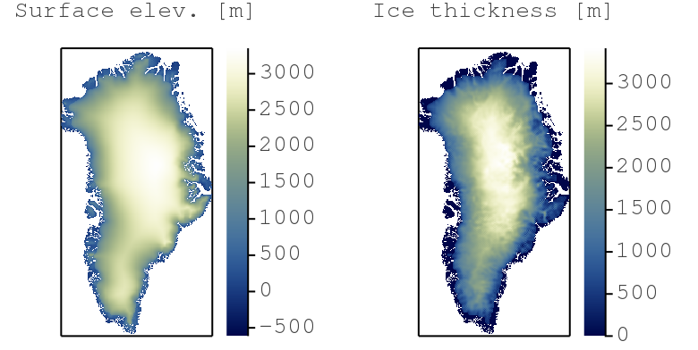
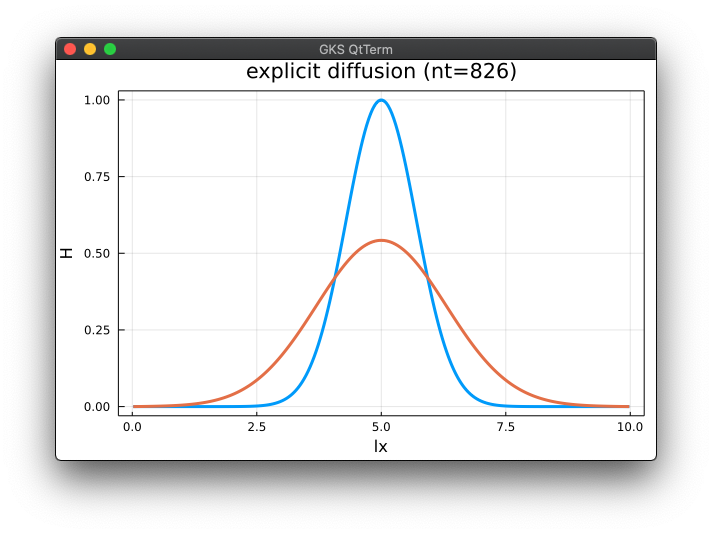
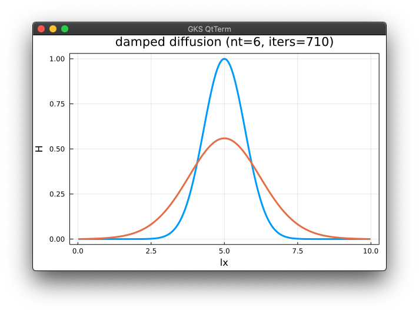
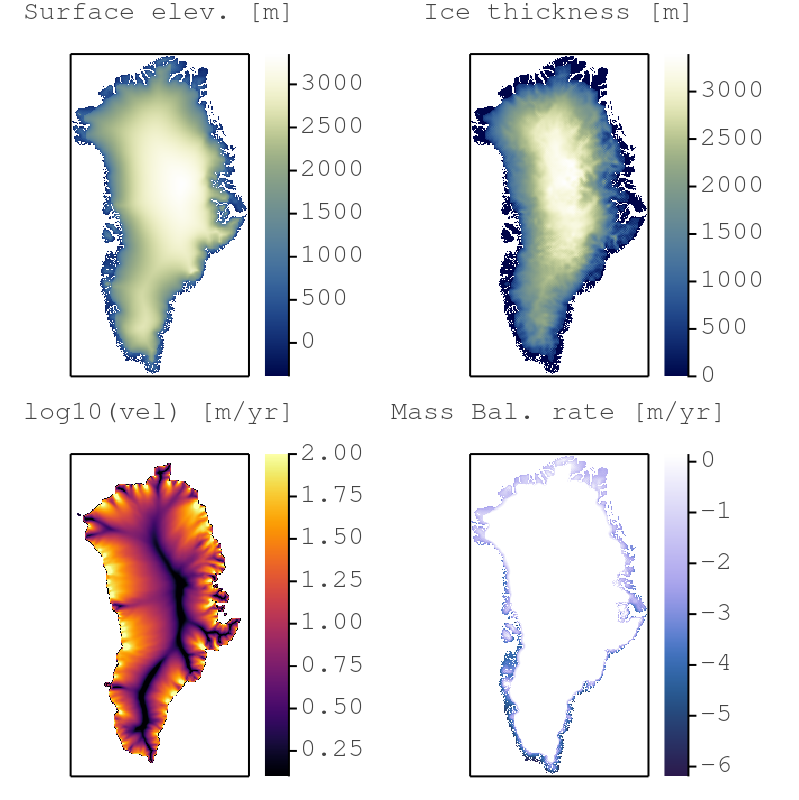
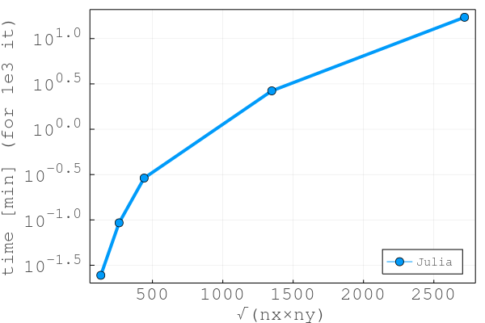
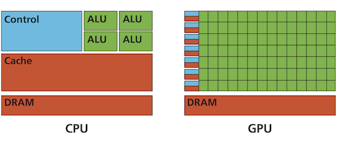
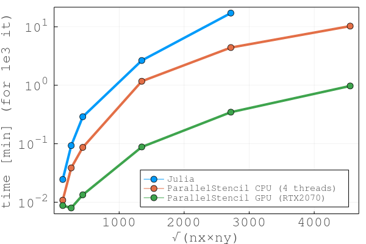
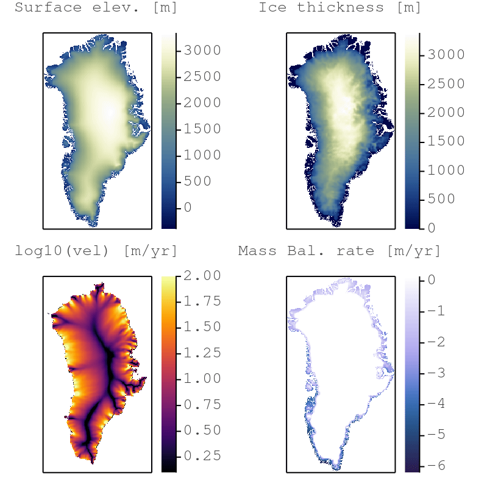
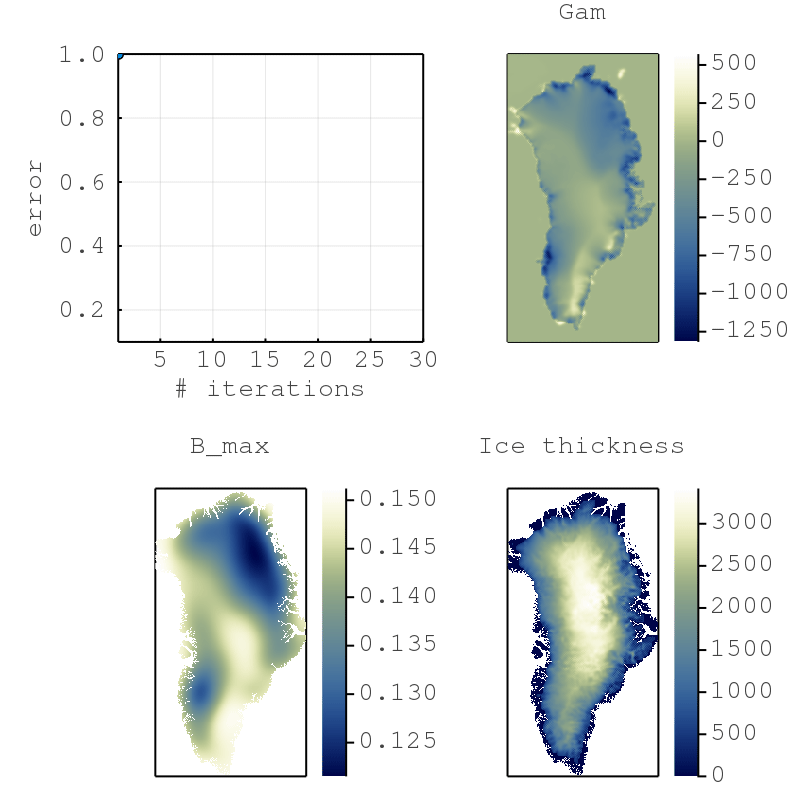
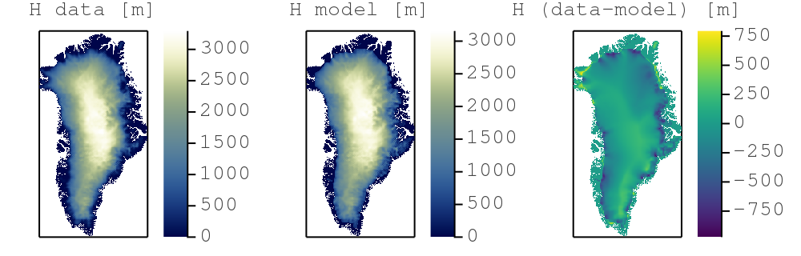

# Solving differential equations in parallel on GPUs
### Workshop - JuliaCon 2021

[](https://github.com/luraess/parallel-gpu-workshop-JuliaCon21/actions)


---


**[vEGU2021: SC4.6 Solving differential equations in parallel with Julia | Thu, 29 Apr, 16:00–17:00 (CEST)](https://meetingorganizer.copernicus.org/EGU21/session/38986)**

👉 **Organisation notes:**
- 💡 The short course material (available on this repository) **was just updated - fetch the latest versions!**
- 👉 **Make sure to go through [Getting started](docs/getting-started.md) before the start of the course.**
- Further interests in solving PDEs with Julia on GPUs❓
    - Sign-up (free) for a hands-on workshop at [JuliaCon2021](https://juliacon.org/2021/)
    - Check out this [online geo-HPC tutorial](https://github.com/luraess/geo-hpc-course)

----
This short course covers trendy areas in modern geocomputing with broad geoscientific applications. The physical processes governing natural systems' evolution are often mathematically described as systems of differential equations. A performant numerical implementation of the solving algorithm leveraging modern hardware is key and permits to tackle problems that were technically not possible a decade ago.


# Content
* [Objectives](#objectives)
* [About this repository](#about-this-repository)
* [Getting started](#getting-started) _(not part of the live course)_
* 👉 [Short course material](#short-course-material)
* [Extras](#extras) _(not part of the live course)_
* [Further reading](#further-reading)


# Objectives
The goal of this short course is to offer an interactive overview on how to solve systems of (partial) differential equations in parallel on GPUs using the [Julia language]. [Julia] combines high-level language simplicity and low-level language performance. The resulting codes and applications are fast, short and readable \[[1][JuliaCon20a], [2][JuliaCon20b], [3][JuliaCon19]\].

We will design and implement a numerical algorithm that predicts ice flow dynamics over mountainous topography (Greenland) using GPU computing (e.g. Fig. below). We will discretise the shallow ice approximation (SIA) equations in our ice flow solver to assess Greenland's ice cap evolution as function of a climate scenario.



**The online course consists of 2 parts:**
1. [**Part 1**](#part-1---julia-and-iterative-solvers) - You will learn about the [Julia language] and iterative PDE solvers.
2. [**Part 2**](#part-2---solving-ice-flow-pdes-on-gpus) - You will implement a GPU parallel PDE solver to predict ice flow dynamics on real topography.

By the end of this short course, you will:
- Have an iterative GPU PDE solver that predicts ice-flow;
- Have a Julia code that achieves similar performance than legacy codes (C, CUDA, MPI);
- Know how the Julia language solves the "two-language problem";
- Be able to leverage the computing power of modern GPU accelerated servers and supercomputers.

> 💡 **Disclaimer**
>- The solvers presented in this short course, based on the **pseudo-transient method**, enable to solve PDEs iteratively and are well-suited for parallel execution (on GPUs). It is **not** the purpose of this course to provide an extensive overview of various solution techniques.
>- The performance assessment is done using the time / iteration metric which reflects the ability of the algorithm to efficiently exploit the memory bandwidth of the (parallel) hardware. Further performance considerations regarding the metric can be found [here](https://github.com/omlins/ParallelStencil.jl).

⤴️ [_back to content_](#content)

# About this repository
The course repository lists following folders and items:
- the [data](data) folder contains various low resolution Greenland input data (bedrock topography, surface elevation, ice thickness, masks, ...) downscaled from [BedMachine Greenland v3] - note the filenames include grid resolution information `(nx, ny)`;
- the [docs](docs) folder contains documentation linked in the [README](README.md);
- the various _output_ folder will contain the codes output, mainly figures in png format;
- the [scripts](scripts) folder contains the scripts this course is about 🎉
- the [extras](extras) folder contains supporting course material (not discussed live during the course);
- the [`Project.toml`](Project.toml) file is a Julia project file, tracking the used packages and enabling a reproducible environment.

> 👉 This repository is an interactive and dynamic source of information related to the short course.
>- Check out the [**Discussion**](https://github.com/luraess/julia-parallel-course-EGU21/discussions) tab if you have general comments, ideas to share or for Q&A.
>- File an [**Issue**](https://github.com/luraess/julia-parallel-course-EGU21/issues) if you encounter any technical problems with the distributed codes.
>- Interact in a open-minded, respectful and inclusive manner.

⤴️ [_back to content_](#content)

# Getting started
> ⚠️ Due to the time limitation, the short course will not cover the [Getting started](docs/getting-started.md) steps. These are meant to provide directions to the participant willing to actively try out the examples during the short course. **It is warmly recommended to perform the [Getting started](docs/getting-started.md) steps before the beginning of the workshop.**

**Please follow the detailed steps in**: [docs/getting-started.md](docs/getting-started.md)

The [provided directions](docs/getting-started.md) will get you started with:
1. Installing Julia v1.6
2. Running the scripts from the course repository.

> 👉 **Note: This course was developed and tested on Julia v1.6. It should work with any Julia version ≥v1.6**. The install configuration were tested on a MacBook Pro running macOS 10.15.7, a Linux GPU server running Ubuntu 20.04 LTS and a Linux GPU server running CentOS 8.

# Short course material
This section lists the material discussed within this 60 min. short course:
* [Part 1 - Julia and iterative solvers](#part-1---julia-and-iterative-solvers)
    * [Why Julia](#why-julia)
    * [Diffusion equation](#diffusion-equation)
    * [Iterative solvers](#iterative-solvers)
* [Part 2 - solving ice flow PDEs on GPUs](#part-2---solving-ice-flow-pdes-on-gpus)
    * [SIA equation](#sia-equation)
    * [SIA implementation](#sia-implementation)
    * [GPU SIA implementation](#gpu-sia-implementation)
    * [XPU SIA implementation](#xpu-sia-implementation)
    * [Greenland's ice cap evolution](#greenlands-ice-cap-evolution)

💡 In this course we will implement a 2D nonlinear diffusion equation on GPUs in Julia using the finite-difference method and an iterative solving approach. The goal is to resolve the shallow ice approximation (SIA) and predict ice flow over Greenland.

⤴️ [_back to content_](#content)


## Part 1 - Julia and iterative solvers

### Why Julia
_by Mauro Werder_

Julia is a modern, general-purpose programming language unifying interactive, high productivity features (like Python, Matlab, etc.) with high performance (like C, Fortran, etc.).  This removes the need to have a separate prototype and production languages (the _two-language problem_).

The main reason to use Julia for scientific computing is:
- high performance & productivity, ditto
- a good package manager (see, e.g., the [`Project.toml`](Project.toml) of this course) making reproducible science easier
- a rapidly expanding number of packages, with many at the forefront of research (e.g. GPU-packages, differential equations, machine learning, automatic differentiation)
- a friendly community with a large number of scientific users

The main reason to use Julia for GPU computing is that it indeed solves the two-language problem in this domain: it works well from prototyping an idea with a simple serial code to massively parallel, multi-node GPU production code.

A short introduction to Julia will be given using the first numerical example of this course (next section).  A very short summary of features covered:
- third-party packages can be installed with the package manager (see [Package installation](docs/getting-started.md#packages-installation))
- use a package with `using XYZ`
- run the code in a file with `include("abc.jl")`
- index into an array with `[ ]` and starts at 1
- vectorized function application do with the dot-notation, e.g. `sin.(x) ./ y` for vectors `x` and `y`
- macros do funky stuff with your code (aka code-transformations) and call them with `@`, e.g. `@time sin(1)` prints the time it takes to evaluate `sin(1)`
- for raster-data handling we use [GeoData.jl](https://github.com/rafaqz/GeoData.jl) (but other packages also exist)

For more info see https://docs.julialang.org.

⤴️ [_back to course material_](#short-course-material)

### Diffusion equation
Let's start with a 1D linear diffusion example to implement both an explicit and iterative implicit PDE solver:

dH/dt = ∇.(D ∇H)

The diffusion of a quantity `H` over time `t` can be described as (1a) a diffusive flux, (1b) a flux balance and (1c) an update rule:
```md
qH    = -D*dH/dx  (1a)
dHdt  =  -dqH/dx  (1b)
dH/dt = dHdt      (1c)
```
The [`diffusion_1D_expl.jl`](scripts/diffusion_1D_expl.jl) code implements an iterative and explicit solution of eq. (1) for an initial Gaussian profile:
```md
H0 = exp(-(x-lx/2.0)^2)
```



But now, you may ask: can we use an implicit algorithm to side-step the CFL-condition, control the (physically motivated) time steps `dt` _**and**_ keep it "matrix-free" ?

⤴️ [_back to course material_](#short-course-material)

### Iterative solvers
_by Ludovic Räss_

The [`diffusion_1D_impl.jl`](scripts/diffusion_1D_impl.jl) code implements an iterative, implicit solution of eq. (1). **How ?** We include the physical time derivative `dH/dt=(H-Hold)/dt` in the previous rate of change `dHdt` to define the residual `ResH`
```md
ResH = -(H-Hold)/dt -dqH/dx
```
and iterate until the values of `ResH` (the residual of the eq. (1)) drop below a defined tolerance level `tol`.


It works, but the "naive" _Picard_ iteration count seems to be pretty high (`niter>7000`). A efficient way to circumvent this is to add "damping" (`damp`) to the rate-of-change `dHdt`, analogous to add friction enabling faster convergence \[[4][Frankel50]\]
```md
dHdt = ResH + damp*dHdt
```
The [`diffusion_1D_damp.jl`](scripts/diffusion_1D_damp.jl) code implements a damped iterative implicit solution of eq. (1). The iteration count drops to `niter~700`. This pseudo-transient approach enables fast as the iteration count scales close to _O(N)_ and not _O(N^2)_.



#### Performance considerations
Performance evaluation is a complex topic as different metrics would lead to different conclusions. Ultimately, efficient algorithms should minimise the time to solution. For iterative algorithms this means:
1) Ensure fast iterations (minimise the time per iteration).
2) Keep the iteration count as low as possible and, in particular, that iteration count scales aroung _O(n)_ with the numerical resolution _n_.

We will here report (1) for various implementations on various computer architectures.

⤴️ [_back to course material_](#short-course-material)


## Part 2 - solving ice flow PDEs on GPUs

### SIA equation applied to the Greenland Ice Sheet
Let's move from the simple **1D linear diffusion** example to the shallow ice approximation (SIA) equation, a **2D nonlinear diffusion** equation for ice thickness _H_:

  dH/dt = ∇.(D ∇S) + M

with surface elevation _S_ the sum of ice thickness _H_ and bed elevation _B_\
  S = H + B,\
surface mass-balance _M_, and non-linear diffusion coefficient\
  D = a Hⁿ⁺² √(∇S.∇S)ⁿ⁻¹\
where _n_ is Glen's n (take =3) and _a_ is the ice flow factor (1.5e-24 Pa⁻ⁿ s⁻¹).

Writting the equation in pseudo-code:
```md
qHx   = -D*dS/dx                  (2a)
qHy   = -D*dS/dy                  (2b)
dHdt  = -(dqHx/dx + dqHy/dy) + M  (2c)
dH/dt = dHdt                      (2d)
```
with the nonlinear diffusion coefficient `D` with the power-law exponent `npow` (aka Glen's exponent):
```md
D = a*H^(npow+2)*sqrt((dS/dx)^2 + (dS/dy)^2)^(npow-1)
```

The topography data, bedrock elevation and ice thickness, is from the
[BedMachine Greenland v3](https://sites.uci.edu/morlighem/dataproducts/bedmachine-greenland/) dataset (Morlighem et al., (2017)) and is loaded via the [GeoData.jl](https://github.com/rafaqz/GeoData.jl) package (see [`helpers.jl`](scripts/helpers.jl)).

We implement climate forcing using a simple mass balance (accumulation and ablation) `M` formulation:
```md
M  = min(grad_b*(S - z_ELA), b_max)
```
as function of the surface elevation `S` and capped by the maximal accumulation rate `b_max`. The mass balance gradient `grad_b` is defined as
```md
grad_b = (1.3517 - 0.014158*LAT)/100.0*0.91
```
where `LAT` is the latitude (taken from \[[5][Machgut16]\]). The equilibrium line altitude `z_ELA` (where accumulation = ablation) is latitude dependent, ranging from 1300m (South) to 1000m (North) as suggested by \[[5][Machgut16]\].


⤴️ [_back to course material_](#short-course-material)

### SIA implementation
The [`iceflow.jl`](scripts/iceflow.jl) code implements the 2D SIA equations using the iterative implicit damped formulation as in [`diffusion_1D_damp.jl`](scripts/diffusion_1D_damp.jl) using the pseudo-transient approach. The calculation of the SIA PDEs resumes in these 13 lines of Julia code:
```julia
# mass balance
M     .= min.(grad_b.*(S .- z_ELA), b_max)
# compute diffusivity
dSdx  .= diff(S, dims=1)/dx
dSdy  .= diff(S, dims=2)/dy
gradS .= sqrt.(av_ya(dSdx).^2 .+ av_xa(dSdy).^2)
D     .= a*av(H).^(npow+2) .* gradS.^(npow-1)
# compute flux
qHx   .= .-av_ya(D).*diff(S[:,2:end-1], dims=1)/dx
qHy   .= .-av_xa(D).*diff(S[2:end-1,:], dims=2)/dy
# update ice thickness
dtau  .= dtausc*min.(10.0, cfl./(epsi .+ av(D)))
ResH  .= .-(diff(qHx, dims=1)/dx .+ diff(qHy, dims=2)/dy) .+ inn(M)
dHdt  .= dHdt.*damp .+ ResH
H[2:end-1,2:end-1] .= max.(0.0, inn(H) .+ dtau.*dHdt)
# apply mask
H[Mask.==0] .= 0.0
# update surface
S     .= B .+ H
```
> 💡 Note that the here discussed SIA codes do not implement any flux limiter scheme to circumvent known accuracy and stability issues. Check out \[[6][Jarosch13], [7][Visnjevic18]\] for further references (the [`iceflow_bench.jl`](extras/iceflow_bench.jl) script implements the benchmark \[[6][Jarosch13]\] that reflects this issue).

The model output is the ice surface elevation, the ice thickness, the ice velocity magnitude and the mass balance:



This implementation of the SIA equations solves the steady-state (i.e. the physical time derivative being removed as `dt->∞`). The last part of this course ([Greenland's ice cap evolution](#greenland-s-ice-cap-evolution)) will show how to achieve an (implicit) ice flow predictions over a specific time span `dt` by including the physical time derivative in the `ResH` term.

#### CPU Performance
The figure below depicts the time 1000 iterations (or pseudo-time steps) take running the [`iceflow.jl`](scripts/iceflow.jl) code on a Intel Xeon Gold 6244 (1 thread - plain Julia):



⤴️ [_back to course material_](#short-course-material)

### GPU SIA implementation
So now we have a cool iterative and implicit SIA solver in less than 100 lines of code 🎉. Good enough for low resolution calculations. What if we need higher resolution and faster time to solution ? Parallel and GPU computing makes it possible. Let's start from the [`iceflow.jl`](scripts/iceflow.jl) code and port it to GPU (with some intermediate steps).

The main idea of GPU parallelisation is to calculate each grid point concurently by a different GPU thread (instaed of the more serial CPU execution) as depicted hereafter:



---

1. Extract the flux `qHx, qHy` from the physics calculations in [`iceflow.jl`](scripts/iceflow.jl):
```julia
# [...] skipped lines
# compute flux
qHx   .= .-av_ya(D).*diff(S[:,2:end-1], dims=1)/dx
qHy   .= .-av_xa(D).*diff(S[2:end-1,:], dims=2)/dy
# [...] skipped lines
```

2. Let's modify these lines into a `compute_flux` function we will then be able to turn into a GPU kernel.
```julia
# [...] skipped lines
function compute_flux!(qHx, qHy, S, D, dx, dy, nx, ny)
    Threads.@threads for iy=1:ny
        for ix=1:nx
            if (ix<=nx-1 && 2<=iy<=ny-1)  qHx[ix,iy] = -0.5*(D[ix,iy]+D[ix+1,iy])*(S[ix+1,iy]-S[ix,iy])/dx  end
            if (2<=ix<=nx-1 && iy<=ny-1)  qHy[ix,iy] = -0.5*(D[ix,iy]+D[ix,iy+1])*(S[ix,iy+1]-S[ix,iy])/dy  end
        end
    end
    return
end
# [...] skipped lines
compute_flux!(qHx, qHy, S, D, dx, dy, nx, ny)
# [...] skipped lines
```
> 💡 Julia enables multi-threading capabilities by simply adding `Threads.@threads` to the outermost loop (here over `iy`).

3. The last step is to replace the (multi-threaded) loops by a vectorised GPU index
```julia
ix = (blockIdx().x-1) * blockDim().x + threadIdx().x
iy = (blockIdx().y-1) * blockDim().y + threadIdx().y
```
 specific to GPU execution. Each `ix` and `iy` are executed concurrently on a different GPU thread:
```julia
using CUDA
# [...] skipped lines
compute_flux!(qHx, qHy, S, D, dx, dy, nx, ny)
    ix = (blockIdx().x-1) * blockDim().x + threadIdx().x
    iy = (blockIdx().y-1) * blockDim().y + threadIdx().y
    if (ix<=nx-1 && 2<=iy<=ny-1)  qHx[ix,iy] = -0.5*(D[ix,iy]+D[ix+1,iy])*(S[ix+1,iy]-S[ix,iy])/dx  end
    if (2<=ix<=nx-1 && iy<=ny-1)  qHy[ix,iy] = -0.5*(D[ix,iy]+D[ix,iy+1])*(S[ix,iy+1]-S[ix,iy])/dy  end
    return
end
# [...] skipped lines
@cuda blocks=cublocks threads=cuthreads compute_flux!(qHx, qHy, S, D, dx, dy, nx, ny)
synchronize()
# [...] skipped lines
```
> 💡 We use `@cuda blocks=cublocks threads=cuthreads` to launch the GPU function on the appropriate number of threads, i.e. "parallel workers". The numerical grid resolution `nx` and `ny` must now be chosen accordingly to the number of parallel workers.

The here described porting procedure steps are exemplified for the 1D diffusion equation ([Porting the diffusion equation to GPUs](#porting-the-diffusion-equation-to-gpus)) available in the [extra material](#extras):
- (1) [`diffusion_1D_damp.jl`](scripts/diffusion_1D_damp.jl)
- (2) [`diffusion_1D_damp_fun.jl`](extras/diffusion_1D_damp_fun.jl)
- (3) [`diffusion_1D_damp_gpu.jl`](extras/diffusion_1D_damp_gpu.jl)
- (4) [`diffusion_1D_damp_xpu.jl`](scripts/diffusion_1D_damp_xpu.jl)

### XPU SIA implementation
Wouldn't it be great to be able to combine the multi-thread CPU and GPU implementations into a single "XPU" code to be able to run on various hardware with only changing a `USE_GPU` switch ? Using [ParallelStencil.jl] enables this, as many more cool features. The [`iceflow_xpu.jl`](scripts/iceflow_xpu.jl) script uses [ParallelStencil.jl] for an XPU implementation on various backends:

```julia
const USE_GPU = false
using ParallelStencil
using ParallelStencil.FiniteDifferences2D
@static if USE_GPU
    @init_parallel_stencil(CUDA, Float64, 2)
else
    @init_parallel_stencil(Threads, Float64, 2)
end
# [...] skipped lines
@parallel function compute_flux!(qHx, qHy, D, S, dx, dy)
    @all(qHx)  = -@av_ya(D)*@d_xi(S)/dx
    @all(qHy)  = -@av_xa(D)*@d_yi(S)/dy
    return
end
# [...] skipped lines
@parallel compute_flux!(qHx, qHy, D, S, dx, dy)
# [...] skipped lines
```
> 💡 Various macros `@(...)` permit to deal with the low-level technicalities and the `USE_GPU` flag enables to switch between CPU and GPU backend.

The resulting code is short and readable and solves the "two-language problem"; development and production code implementations are regrouped into a single code.

#### GPU - CPU Performance
The figure below depicts the time 1000 iterations (or pseudo-time steps) take running the [`iceflow_xpu.jl`](scripts/iceflow_xpu.jl) code on:
- an Intel Xeon Gold 6244 (4 threads - cores)
- an Nvidia RTX 2070 GPU



⤴️ [_back to course material_](#short-course-material)

### Greenland's ice cap evolution
We can finally use our XPU ice flow solver to simulate the evolution of Greenland's ice cap for a specific climate scenario. The steps are following:
1. Compute the steady-state ice thickness for current climate forcing (mass balance function as described in [SIA equation](#sia-equation) section)
2. Apply a time-dependent linear increase of the ELA (the equilibrium line where accumulation = ablation) of 1m/yr over the next 2500yrs. We here assume that an increase in annual mean temperature of 0.6°C is equivalent to a 100m shift of the ELA, thus 1m/yr represents 0.3°C per 50yrs. The [`iceflow_xpu_evo.jl`](scripts/iceflow_xpu_evo.jl) code implements this climate evolution model and produces the following predictions for the Greenland ice cap evolution:



> Note that our climate scenario may reflect some extreme warming over the next 2500yrs.

⤴️ [_back to course material_](#short-course-material)

# Extras
> ⚠️ Due to the time limitation, the short course will not cover the [extras](#extras) material. This information complements the course's main content and may provide intermediate and/or additional development steps.

Extra material comprises:
* [Porting the diffusion equation to GPUs](#porting-the-diffusion-equation-to-gpus)
* [Simple inversion](#simple-inversion)
* [Performance metric](performance-metric)
* [Multi-XPU implementation](#multi-xpu-implementation)

⤴️ [_back to content_](#content)

## Porting the diffusion equation to GPUs
This extra example complements the [GPU SIA implementation](#gpu-sia-implementation) and the [XPU SIA implementation](#xpu-sia-implementation).

### Parallel GPU computing
Let's start from the [`diffusion_1D_damp.jl`](scripts/diffusion_1D_damp.jl) code, a cool iterative and implicit solver in about 30 lines of code 🎉, and port it to GPU (with some intermediate steps).

1. Extract the physics calculations from [`diffusion_1D_damp.jl`](scripts/diffusion_1D_damp.jl), i.e. the time loop:
```julia
# [...] skipped lines
qH         .= -D*diff(H)/dx              # flux
ResH       .= -(H[2:end-1] - Hold[2:end-1])/dt - diff(qH)/dx # residual of the PDE
dHdtau     .= ResH + damp*dHdtau         # damped rate of change
H[2:end-1] .= H[2:end-1] + dtau*dHdtau   # update rule, sets the BC as H[1]=H[end]=0
# [...] skipped lines
```

2. Split the calculations into separate functions (or kernels) and call those functions within the time loop. The [`diffusion_1D_damp_fun.jl`](extras/diffusion_1D_damp_fun.jl) implements those modifications:
```julia
function compute_flux!(qH, H, D, dx, nx)
    Threads.@threads for ix=1:nx
        if (ix<=nx-1)  qH[ix] = -D*(H[ix+1]-H[ix])/dx  end
    end
    return
end

function compute_rate!(ResH, dHdt, H, Hold, qH, dt, damp, dx, nx)
    Threads.@threads for ix=1:nx
        if (2<=ix<=nx-1)  ResH[ix-1] = -(H[ix] - Hold[ix])/dt -(qH[ix]-qH[ix-1])/dx  end
        if (2<=ix<=nx-1)  dHdt[ix-1] = ResH[ix-1] + damp*dHdt[ix-1]  end
    end
    return
end

function compute_update!(H, dHdt, dtau, nx)
    Threads.@threads for ix=1:nx
        if (2<=ix<=nx-1)  H[ix] = H[ix] + dtau*dHdt[ix-1]  end
    end
    return
end
# [...] skipped lines
compute_flux!(qH, H, D, dx, nx)
compute_rate!(ResH, dHdt, H, Hold, qH, dt, damp, dx, nx)
compute_update!(H, dHdt, dtau, nx)
# [...] skipped lines
```
> 💡 Julia enables multi-threading capabilities by simply adding `Threads.@threads` to the outermost loop (here over `ix`).

3. The last step is to replace the (multi-threaded) loop by a vectorised index `ix = (blockIdx().x-1) * blockDim().x + threadIdx().x` specific to GPU execution. Each `ix` is executed concurrently on a different GPU thread. The [`diffusion_1D_damp_gpu.jl`](extras/diffusion_1D_damp_gpu.jl) implements those modifications to run on GPUs:
```julia
using CUDA
# [...] skipped lines
function compute_flux!(qH, H, D, dx, nx)
    ix = (blockIdx().x-1) * blockDim().x + threadIdx().x
    if (ix<=nx-1)  qH[ix] = -D*(H[ix+1]-H[ix])/dx  end
    return
end

function compute_rate!(ResH, dHdt, H, Hold, qH, dt, damp, dx, nx)
    ix = (blockIdx().x-1) * blockDim().x + threadIdx().x
    if (2<=ix<=nx-1)  ResH[ix-1] = -(H[ix] - Hold[ix])/dt -(qH[ix]-qH[ix-1])/dx  end
    if (2<=ix<=nx-1)  dHdt[ix-1] = ResH[ix-1] + damp*dHdt[ix-1]  end
    return
end

function compute_update!(H, dHdt, dtau, nx)
    ix = (blockIdx().x-1) * blockDim().x + threadIdx().x
    if (2<=ix<=nx-1)  H[ix] = H[ix] + dtau*dHdt[ix-1]  end
    return
end
# [...] skipped lines
@cuda blocks=cublocks threads=cuthreads compute_flux!(qH, H, D, dx, nx)
synchronize()
@cuda blocks=cublocks threads=cuthreads compute_rate!(ResH, dHdt, H, Hold, qH, dt, damp, dx, nx)
synchronize()
@cuda blocks=cublocks threads=cuthreads compute_update!(H, dHdt, dtau, nx)
synchronize()
# [...] skipped lines
```
> 💡 We use `@cuda blocks=cublocks threads=cuthreads` to launch the GPU function on the appropriate number of threads, i.e. "parallel workers". The numerical grid resolution `nx` must now be chosen accordingly to the number of workers `nx=cublocks*cuthreads`.

### XPU computing
Wouldn't it be great to be able to combine the multi-thread CPU and GPU implementations into a single "XPU" code to be able to run on various hardware with only changing a `USE_GPU` switch ? Using [ParallelStencil.jl] enables this, as well more other cool features. The [`diffusion_1D_damp_xpu.jl`](scripts/diffusion_1D_damp_xpu.jl) uses [ParallelStencil.jl] for an XPU implementation on various backends:

```julia
const USE_GPU = false
using ParallelStencil
using ParallelStencil.FiniteDifferences1D
@static if USE_GPU
    @init_parallel_stencil(CUDA, Float64, 1)
else
    @init_parallel_stencil(Threads, Float64, 1)
end
# [...] skipped lines
@parallel function compute_flux!(qH, H, D, dx)
    @all(qH) = -D*@d(H)/dx
    return
end

@parallel function compute_rate!(ResH, dHdt, H, Hold, qH, dt, damp, dx)
    @all(ResH) = -(@inn(H) - @inn(Hold))/dt -@d(qH)/dx
    @all(dHdt) = @all(ResH) + damp*@all(dHdt)
    return
end

@parallel function compute_update!(H, dHdt, dtau)
    @inn(H) = @inn(H) + dtau*@all(dHdt)
    return
end
# [...] skipped lines
@parallel compute_flux!(qH, H, D, dx)
@parallel compute_rate!(ResH, dHdt, H, Hold, qH, dt, damp, dx)
@parallel compute_update!(H, dHdt, dtau)
# [...] skipped lines
```
Various macros `@(...)` permit to deal with the low-level technicalities and the `USE_GPU` flag enables to switch between CPU and GPU backend.

⤴️ [_back to extras_](#extras)

## Simple inversion
Using the inversion approach proposed by \[[7][Visnjevic18]\], our ice flow solver [`iceflow.jl`](scripts/iceflow.jl) can be embedded into an inversion framework to retrieve spatially variable maximum accumulation rate `b_max` in order to constrain ice thickness distribution over Greenland. The following animation depicts the evolution of the inversion procedure as function of the 30 inversion steps and was produced using the [`iceflow_inverse.jl`](extras/iceflow_inverse.jl) code. `Gam` represents the misfit between the observed `Hice` and the calculated `H` ice thickness, `B_max` represents the spatially variable maximal accumulation.



The ice thickness obtained from the inversion procedure can be further compared to the [BedMachine Greenland v3] ice thickness data:



> 💡 Note that the inversion procedure serves here as proof of concept, as higher resolution and finer tuning may be needed to further improve the misfit minimisation.

⤴️ [_back to extras_](#extras)

## Performance metric
Majority of stencil based codes as in this course are memory bounded, meaning the limiting factor in performance is the rate at which memory is transferred from and back between the memory and the arithmetic units. The maximal rate at which the memory transfers occur is the memory copy rate, in the order of 50 GB/s for CPUs and about 1 TB/s for modern GPUs. The effective memory throughput metric (T_eff) measures how good an iterative stencil-based algorithm performs in terms of memory throughput, to be compared to the memory copy rate.

Check out the [performance metric section](https://github.com/omlins/ParallelStencil.jl#performance-metric) from the [ParallelStencil.jl] module and this [JuliaCon2020][JuliaCon20a] presentation \[[1][JuliaCon20a]\].

⤴️ [_back to extras_](#extras)

## Multi-XPU implementation
Check out [this material](https://github.com/luraess/geo-hpc-course#running-julia-mpi) to figure out how combining [ImplicitGlobalGrid.jl] to [ParallelStencil.jl] enables efficient distributed memory parallelisation on multiple XPUs.

⤴️ [_back to extras_](#extras)


# Further reading
\[1\] [Omlin, S., Räss, L., Kwasniewski, G., Malvoisin, B., & Podladchikov, Y. Y. (2020). Solving Nonlinear Multi-Physics on GPU Supercomputers with Julia. JuliaCon Conference, virtual.][JuliaCon20a]

\[2\] [Räss, L., Reuber, G., & Omlin, S. (2020). Multi-Physics 3-D Inversion on GPU Supercomputers with Julia. JuliaCon Conference, virtual.][JuliaCon20b]

\[3\] [Räss, L., Omlin, S., & Podladchikov, Y. Y. (2019). Porting a Massively Parallel Multi-GPU Application to Julia: a 3-D Nonlinear Multi-Physics Flow Solver. JuliaCon Conference, Baltimore, USA.][JuliaCon19]

\[4\] [Frankel, S. P. (1950). Convergence rates of iterative treatments of partial differential equations, Mathe. Tables Other Aids Comput., 4, 65–75.][Frankel50]

\[5\] [Machgut, H. et al. (2016). Greenland surface mass-balance observations from the ice-sheet ablation area and local glaciers. Journal of Glaciology, 62(235), 861-887.][Machgut16]

\[6\] [Jarosch, A. H., Schoof, C. G., & Anslow, F. S. (2013). Restoring mass conservation to shallow ice flow models over complex terrain, The Cryosphere, 7, 229–240.][Jarosch13]

\[7\] [Visnjevic, V., Herman, F., & Podladchikov, Y. (2018). Reconstructing spatially variable mass balances from past ice extents by inverse modeling. Journal of Glaciology, 64(248), 957-968.][Visnjevic18]

⤴️ [_back to content_](#content)


[Julia]: https://julialang.org
[Julia language]: https://docs.julialang.org/en/v1/
[Julia REPL]: https://docs.julialang.org/en/v1/stdlib/REPL/
[Base.Threads]: https://docs.julialang.org/en/v1/base/multi-threading/
[JULIA_NUM_THREADS]:https://docs.julialang.org/en/v1.0.0/manual/environment-variables/#JULIA_NUM_THREADS-1
[CUDA.jl]: https://github.com/JuliaGPU/CUDA.jl
[JuliaGPU]: https://juliagpu.org
[ParallelStencil.jl]: https://github.com/omlins/ParallelStencil.jl
[ImplicitGlobalGrid.jl]: https://github.com/eth-cscs/ImplicitGlobalGrid.jl

[BedMachine Greenland v3]: https://sites.uci.edu/morlighem/dataproducts/bedmachine-greenland/

[JuliaCon20a]: https://www.youtube.com/watch?v=vPsfZUqI4_0
[JuliaCon20b]: https://www.youtube.com/watch?v=1t1AKnnGRqA
[JuliaCon19]: https://www.youtube.com/watch?v=b90qqbYJ58Q
[Frankel50]: https://doi.org/10.2307/2002770
[Machgut16]: https://doi.org/10.1017/jog.2016.75
[Jarosch13]: https://doi.org/10.5194/tc-7-229-2013
[Visnjevic18]: https://doi.org/10.1017/jog.2018.82
