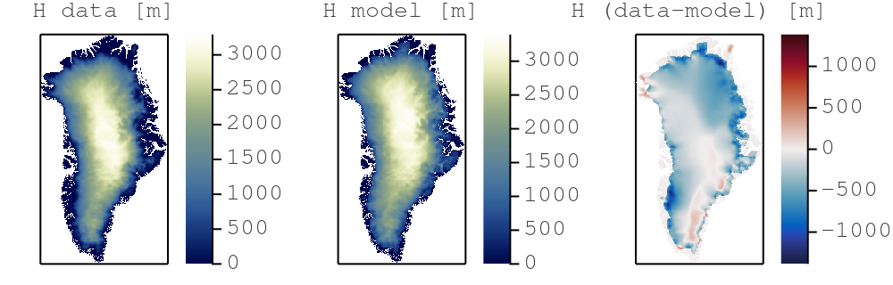

# Getting started
> ⚠️ Due to the time limitation, the short course will not cover the [Getting started](#getting-started) steps. These are meant to provide directions to the participant willing to actively try out the examples during the short course. **It is warmly recommended to perform the [Getting started](#getting-started) steps before the beginning of the workshop.**

The provided directions will get you started with:
1. [Installing Julia v1.6 (or later)](#installing-julia-v16-or-later) - additionally, two configurations are suggested:
- running Julia from the [terminal with an external text editor](#terminal--external-editor)
- running Julia from [VS Code](#vs-code)

2. [Running the scripts](#running-the-scripts) from the course repository.

> 👉 **Note: This course was developed and tested on Julia v1.6. It should work with any Julia version ≥v1.6**. The install configuration were tested on a MacBook Pro running macOS 10.15.7, a Linux GPU server running Ubuntu 20.04 LTS and a Linux GPU server running CentOS 8.

⬅️ [_back to Content_](https://github.com/luraess/julia-parallel-course-EGU21#content)

## Installing Julia v1.6 (or later)
Check you have an active internet connexion and [download Julia v1.6](https://julialang.org/downloads/) for your platform following the install directions provided under **\[help\]** if needed.

Alternatively, open a terminal and download the binaries (select the one for your platform):
```sh
wget https://julialang-s3.julialang.org/bin/winnt/x64/1.6/julia-1.6.0-win64.exe # Windows
wget https://julialang-s3.julialang.org/bin/mac/x64/1.6/julia-1.6.0-mac64.dmg # macOS
wget https://julialang-s3.julialang.org/bin/linux/x64/1.6/julia-1.6.0-linux-x86_64.tar.gz # Linux x86
```
Then add Julia to PATH (usually done in your `.bashrc`, `.profile`, or `config` file).

### Terminal + external editor
Ensure you have a text editor with syntax highlighting support for Julia. From within the terminal, type
```sh
julia
```
to make sure that the Julia REPL (aka terminal) starts.  Exit with Ctrl-d.

### VS Code
If you'd enjoy a more IDE type of environment, [check out VS Code](https://code.visualstudio.com). Follow the [installation directions](https://github.com/julia-vscode/julia-vscode#getting-started) for the [Julia VS Code extension](https://www.julia-vscode.org).

## Running the scripts
To get started with the course,
1. clone (or download the ZIP archive) the course repository ([help here](https://docs.github.com/en/github/creating-cloning-and-archiving-repositories/cloning-a-repository))
```sh
git clone https://github.com/luraess/julia-parallel-course-EGU21.git
```
2. Navigate to `julia-parallel-course-EGU21`
```sh
cd julia-parallel-course-EGU21
```
3. From the terminal, launch Julia with the `--project` flag to read-in project environment related informations such as used packages
```sh
julia --project
```
3. From VS Code, follow the [instructions from the documentation](https://www.julia-vscode.org/docs/stable/gettingstarted/) to get started.

### Packages installation

Now that you launched Julia, you should be in the [Julia REPL]. You need to ensure all the packages you need to be installed before using them. To do so, enter the [Pkg mode](https://docs.julialang.org/en/v1/stdlib/REPL/#Pkg-mode) by typing `]`. Then, `instantiate` the project which should trigger the download of the packages (`st` lists the package status). Exit the Pkg mode with CRTL+C:
```julia-repl
julia> ]

(julia-parallel-course-EGU21) pkg> st
Status `~/julia-parallel-course-EGU21/Project.toml`
    # [...]

(julia-parallel-course-EGU21) pkg> instantiate
   Updating registry at `~/.julia/registries/General`
   Updating git-repo `https://github.com/JuliaRegistries/General.git`
   # [...]

julia>
```
To test your install, go to the [scripts](../scripts) folder and run the [`iceflow.jl`](../scripts/iceflow.jl) code. You can execute shell commands from within the [Julia REPL] first typing `;`:
```julia-repl
julia> ;

shell> cd scripts/

julia> include("iceflow.jl")
```
Running this the first time will (pre-)complie the various installed packages and will take some time. Subsequent runs, by executing `include("iceflow.jl")`, should take around 10s.

You should then see two figures saved in a newly created **_output_** folder, the second being the comparison between modelled and observed ice thickness distribution over Greenland:



## Multi-threading on CPUs
On the CPU, multi-threading is made accessible via [Base.Threads]. To make use of threads, Julia needs to be launched with
```
julia --project -t auto
```
which will launch Julia with as many threads are there are cores on your machine (including hyper-threaded cores).  Alternatively set
the environment variable [JULIA_NUM_THREADS], e.g. `export JULIA_NUM_THREADS=2` to enable 2 threads.

## Running on GPUs
The [CUDA.jl] module permits to launch compute kernels on Nvidia GPUs natively from within [Julia]. [JuliaGPU] provides further reading and [introductory material](https://juliagpu.gitlab.io/CUDA.jl/tutorials/introduction/) about GPU ecosystems within Julia. If you have an Nvidia CUDA capable GPU device, also export following environment vaiable prior to installing the [CUDA.jl] package:
```sh
export JULIA_CUDA_USE_BINARYBUILDER=false
```
We will use the GPU acceleration in the [second part](https://github.com/luraess/julia-parallel-course-EGU21#gpu-sia-implementation) of the course.

⤴️ [_back to top_](#getting-started)

⬅️ [_back to Content_](https://github.com/luraess/julia-parallel-course-EGU21#content)

[Julia REPL]: https://docs.julialang.org/en/v1/stdlib/REPL/
[Base.Threads]: https://docs.julialang.org/en/v1/base/multi-threading/
[Julia]: https://julialang.org
[CUDA.jl]: https://github.com/JuliaGPU/CUDA.jl
[JuliaGPU]: https://juliagpu.org
